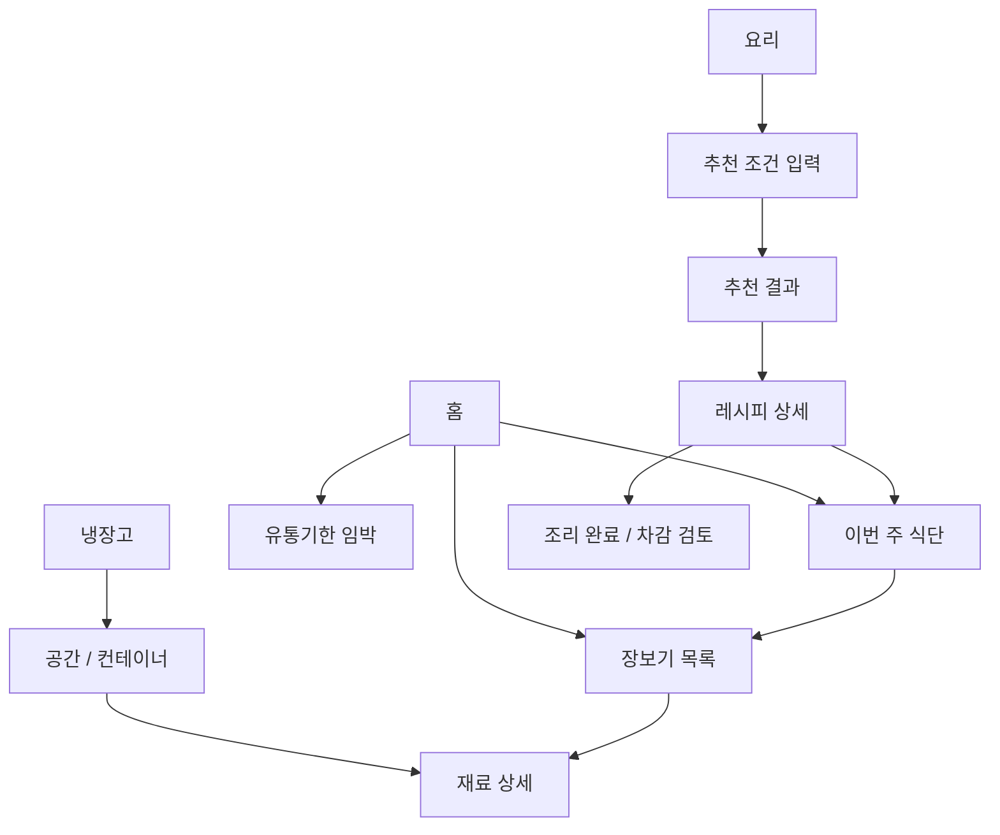

# Fridge Flow 제품 기획서

- 문서 상태: 초안 v0.4
- 작성일: 2026-07-29
- 최종 수정일: 2026-08-02
- 대상: 제품 기획, 디자인, 앱·백엔드·AI 개발
- 현재 단계: 구현 전

## 1. 제품 개요

Fridge Flow는 냉장고 속 재료의 **종류, 수량, 보관 위치, 유통기한**을 한눈에 보여주고, 이를 **레시피 추천, 주간 식단, 장보기, 자동 재고 차감**으로 연결하는 앱이다.

핵심 경험은 다음 한 문장으로 설명한다.

> “지금 무엇이 있고, 어디에 있으며, 무엇을 해 먹을 수 있고, 다음에 무엇을 사야 하는지”를 한 곳에서 해결한다.

AI는 요리를 제안하고 사용자의 요구에 맞게 레시피를 구성하지만, 재고와 수량 계산 같은 사실 데이터는 규칙 기반 시스템이 관리한다.

## 2. 해결할 문제

사용자는 다음과 같은 단절을 겪는다.

1. 냉장고에 무엇이 있는지 기억하지 못해 중복 구매하거나 재료를 버린다.
2. 재료가 냉장실, 냉동실, 서랍, 용기 중 어디에 있는지 찾기 어렵다.
3. 가진 재료로 무엇을 만들 수 있는지 판단하는 데 시간이 든다.
4. 식단을 짜도 필요한 재료와 현재 재고의 차이를 다시 계산해야 한다.
5. 요리 후 실제 사용량을 재고에서 일일이 빼야 해서 기록이 금방 틀어진다.
6. 일반적인 레시피 추천은 알레르기, 다이어트, 조리 시간, 선호를 충분히 반영하지 못하거나 반복적이다.
7. 영양성분과 칼로리의 출처와 신뢰 수준이 불분명한 경우가 많다.

Fridge Flow는 “재고 등록 → 위치·기한 파악 → 요리/식단 선택 → 장보기 → 조리 → 재고 차감”을 하나의 닫힌 순환으로 만든다.

## 3. 목표 사용자

### 3.1 1차 사용자

- 1~2인 가구로 식재료를 자주 남기는 사람
- 냉장고 재료를 기반으로 빠르게 한 끼를 결정하고 싶은 사람
- 주간 식단이나 다이어트 식단을 계획하는 사람
- 냉장·냉동실 안에서 재료 위치를 자주 잊는 사람

### 3.2 이후 확장 사용자

- 알레르기나 특정 식단 원칙이 있는 사용자
- 여러 저장 공간(김치냉장고, 팬트리 등)을 관리하는 사용자

### 3.3 대표 사용자 상황

- “퇴근했는데 지금 있는 재료로 20분 안에 만들 수 있는 저녁이 필요하다.”
- “이번 주 다이어트 식단을 짜고 부족한 것만 사고 싶다.”
- “두부가 있었던 것 같은데 어느 칸에 있는지 모르겠다.”
- “유통기한이 먼저 끝나는 재료부터 소비하고 싶다.”

## 4. 제품 원칙

1. **한눈에 보인다.** 홈과 냉장고 화면에서 중요 정보가 스크롤과 검색을 최소화해 드러나야 한다.
2. **1분 안에 관리한다.** 흔한 재료의 등록 또는 수정은 60초 이내에 끝나야 한다.
3. **로컬이 원본이고 백업은 사용자가 소유한다.** 재고, 레시피, 식단과 장보기 목록은 기기 SQLite에 즉시 저장한다. 중앙 DB나 자동 서버 동기화는 두지 않고 사용자가 내보낸 백업 파일로 데이터를 이동·복원한다.
4. **AI는 제안하고 사용자가 결정한다.** 추천 전 의도를 확인하고, 자동 차감이나 일괄 변경은 검토·되돌리기가 가능해야 한다.
5. **계산과 생성은 분리한다.** 수량, 부족분, 영양 합계는 검증 가능한 로직이 계산하고 AI는 결과를 임의로 바꾸지 않는다.
6. **신뢰도를 보여준다.** 영양 값의 출처, 대체재, 추정치와 불확실성을 숨기지 않는다.
7. **반복을 줄이되 익숙함은 보존한다.** 최근 추천을 무조건 반복하지 않으며, 사용자가 좋아하고 저장한 요리는 적절한 간격으로 다시 제안한다.

## 5. 목표와 성공 지표

### 5.1 제품 목표

- 사용자가 실제 재고를 빠르고 정확하게 유지하게 한다.
- 보유 재료의 활용률을 높이고 유통기한 경과 폐기를 줄인다.
- “오늘 뭐 먹지?”에서 실행 가능한 레시피 결정까지의 시간을 줄인다.
- 주간 식단에서 필요한 장보기와 조리 후 차감을 자동 연결한다.

### 5.2 핵심 성공 지표

| 지표 | MVP 목표 | 측정 방법 |
|---|---:|---|
| 재료 등록 완료 시간 | 중앙값 60초 이하 | 등록 시작~저장 이벤트 |
| 재료 수정 완료 시간 | 중앙값 30초 이하 | 상세 진입~저장 이벤트 |
| 첫 재료 등록 성공률 | 90% 이상 | 등록 시작 대비 완료 |
| 홈 로컬 표시 시간 | 앱 시작 후 1초 이내 목표 | 콜드 스타트 성능 로그 |
| “바로 조리 가능” 추천 적합률 | 상위 5개 중 4개 이상이 수량까지 충족 | 평가 데이터셋 + 사용자 피드백 |
| 부족 재료 계산 정확도 | 알려진 단위 범위에서 99% 이상 | 자동화된 계산 테스트 |
| 추천 다양성 | 최근 7일 추천 상위 5개의 중복률 30% 이하 | 추천 노출 로그 |
| 차감 신뢰성 | 중복 차감 0건, 7일 내 모든 차감 undo 가능 | 로컬 거래·활동 로그 |
| 식단→장보기 전환 | 식단 생성 사용자의 60% 이상 | 장보기 목록 생성 이벤트 |
| 백업 복원 성공률 | 호환되는 정상 백업 파일 100% | Drive 내보내기→초기화→파일 선택 복원 E2E |
| 로컬 저장 신뢰성 | 정상 종료·재시작 후 승인된 변경 유실 0건 | SQLite transaction·migration E2E |
| AI 접근 제한 | 허용 목록 밖의 검증된 Google 계정 호출 성공 0건 | Netlify Function 인증·인가 테스트 |
| AI 비용 방어 | 환경변수의 모델·입출력 제한 우회 0건 | 요청 schema·Netlify rate limit·OpenAI 프로젝트 사용량 점검 |

실사용을 시작한 뒤에는 4주 사용 지속률, 주간 식단 완료율, 유통기한 임박 재료 소비/폐기 표시율을 장기 지표로 추가한다.

## 6. 범위

### 6.1 MVP에 포함

- 재료 등록, 조회, 수정, 삭제
- 재료 수량·단위, 구매일, 유통기한, 메모
- 냉장고/냉동고/팬트리의 구역 및 컨테이너 생성
- 컨테이너 배치와 재료 드래그 이동
- 유통기한 임박/경과 표시와 정렬
- 가진 재료 기준 “바로 가능” 및 “조금만 사면 가능” 레시피
- 추천 요청 전 식단 목적·제외 재료·조리 시간·인분 입력
- 레시피 상세, 영양성분, 저장/좋아요/싫어요
- 주간 식단 등록과 인분 조정
- 재고를 반영한 부족 재료 및 장보기 목록 계산
- 장보기 체크박스와 구매한 항목의 재고 등록 보조
- 조리 완료 후 예상 차감 내역 확인, 적용, 실행 취소
- 홈의 이번 주 식단, 장보기 진행률, 유통기한 임박 재료
- Google 로그인과 로컬 데이터 소유 계정 연결
- 기기 SQLite를 사용자 데이터의 유일한 실행 원본으로 사용
- `.ffbackup` 내보내기와 Android 시스템 파일 선택기를 통한 Google Drive 저장·복원
- Google ID token과 환경변수 허용 목록으로 보호되는 AI 전용 Netlify Function
- Firebase App Distribution을 통한 초대 기반 Android 배포

### 6.2 MVP 이후

- 바코드/영수증/OCR 기반 빠른 등록
- `expo-notifications` 기반 기기 내 유통기한·식단 예약 알림과 사용자별 알림 시간 설정
- 알림은 사용자가 기능을 켤 때 권한을 요청하고, 기본값은 임박 재료 일 1회 요약으로 제한한다.
- 서버 push token·FCM·상시 scheduler는 도입하지 않는다. 원격 알림 필요성이 실제로 확인될 때 별도 검토한다.
- 가격 비교, 마트/배달 장바구니 연동
- 냉장고 사진 인식과 자동 재료 추출
- 음성 등록 및 음성 조리 모드
- 웨어러블/건강 앱 연동
- 고급 영양 목표와 전문가용 기능

### 6.3 의도적으로 제외

- 의료 진단 또는 치료 목적의 식단 처방
- AI가 사용자 확인 없이 재고를 영구 변경하는 기능
- 음식의 실제 안전 여부를 유통기한만으로 판정하는 기능
- MVP 단계의 정밀한 3D 냉장고 모델링
- 모든 부피·무게·개수 단위의 임의 자동 변환

## 7. 정보 구조와 주요 화면

하단 탭은 다섯 개를 기본으로 한다.

1. **홈**: 오늘/이번 주 식단, 장보기 진행률, 임박 재료, 빠른 추천
2. **냉장고**: 공간·컨테이너 시각화, 재료 목록, 검색/필터
3. **요리**: 바로 가능, 조금만 사면 가능, 저장 레시피, 추천 요청
4. **식단**: 주간 캘린더, 끼니 배치, 인분, 필요한 재료
5. **더보기**: 사용자 선호, 알레르기, 백업·복원, AI 사용 가능 상태, 데이터 출처

화면 이동의 기본 구조:

## 8. 핵심 사용자 흐름

### 8.0 Google 로그인과 로컬 데이터 연결

1. 사용자는 앱 시작 화면에서 `Google로 계속하기`를 선택한다.
2. 앱은 Google 로그인 결과의 안정적인 계정 식별자 `sub`를 현재 `user.db`의 소유 계정과 연결한다. ID token 원문은 SQLite나 백업에 저장하지 않는다.
3. 같은 기기에서 기존 `user.db`와 다른 Google 계정으로 로그인하면 데이터를 바로 열지 않고 기존 계정으로 다시 로그인하거나 로컬 데이터를 초기화하도록 안내한다.
4. Google 로그인 상태는 Android의 안전한 인증 저장소에서 유지한다. 오프라인이거나 token 갱신이 실패해도 이미 연결된 기기의 로컬 핵심 기능은 계속 사용할 수 있다.
5. AI 기능을 사용할 때 앱은 최신 Google ID token을 HTTPS로 Netlify Function에 전달한다.
6. 함수는 token의 서명·audience·issuer·만료·이메일 검증 상태를 확인하고 Netlify 환경변수의 허용 Google 계정 목록과 비교한다.
7. 허용되지 않은 계정은 AI 요청만 `403 AI_ACCOUNT_NOT_ALLOWED`로 거부한다. 서버에는 회원 계정이나 사용자 데이터를 만들지 않는다.
8. 재설치·기기 변경 시 서버 bootstrap은 제공하지 않으며 사용자가 Google Drive 등에 저장한 `.ffbackup`을 직접 선택해 복원한다.

### 8.1 재료 등록

1. 냉장고 화면에서 `+ 재료`를 누른다.
2. 재료명을 검색하거나 직접 입력한다.
3. 최근 사용값을 바탕으로 수량, 단위, 위치가 미리 제안된다.
4. 유통기한은 선택 입력이며 `없음/모름`을 명시할 수 있다.
5. 저장 즉시 기기 SQLite에 반영되고 화면에 나타난다.

빠른 등록에서는 이름, 수량, 위치만으로 저장할 수 있다. 상세 정보는 나중에 보완한다.

### 8.2 위치 확인과 드래그 이동

1. 사용자가 냉장고의 공간(냉장실/냉동실/팬트리)과 컨테이너를 본다.
2. 재료 카드를 길게 눌러 다른 컨테이너로 드래그한다.
3. 놓는 즉시 위치가 로컬에 반영된다.
4. 잘못 이동했을 때 스낵바에서 실행 취소할 수 있다.

컨테이너 위치는 행·열 기반 격자 좌표와 칸 단위 크기로 저장해 화면 크기가 달라도 배치를 안정적으로 재현한다. 재료 자체는 MVP에서 컨테이너 안의 정렬 순서까지만 관리한다.

### 8.3 지금 먹을 요리 추천

1. 사용자가 `지금 뭐 먹지?`를 누른다.
2. 앱이 다음을 짧은 칩/입력으로 확인한다.
   - 목적: 일반식, 다이어트, 고단백, 가볍게 등
   - 끼니와 인분
   - 최대 조리 시간
   - 제외할 재료/알레르기
   - 꼭 쓰고 싶은 재료
3. 시스템이 재고와 수량으로 후보를 먼저 계산한다.
4. 결과를 `바로 가능`과 `재료 1~3개 추가`로 나눠 보여준다.
5. 사용자는 추천 이유, 부족 재료, 예상 시간, 영양 요약을 보고 선택한다.
6. 상세 레시피 생성이 필요한 경우에만 AI가 사용자 조건과 검증된 후보 데이터를 이용한다.

### 8.4 주간 식단과 장보기

1. 사용자가 직접 레시피를 배치하거나 목표를 입력해 주간 식단 초안을 받는다.
2. 요일/끼니/인분을 수정한다.
3. 시스템이 전체 필요량을 합산하고 현재 재고의 사용 가능한 양을 뺀다.
4. 부족분을 재료별로 합쳐 장보기 목록을 만든다.
5. 사용자는 이미 집에 있는 항목을 제외하거나 수량을 수정한다.
6. 구매 체크 시 바로 재고에 추가할지 묻는다.

### 8.5 조리와 자동 차감

1. 레시피에서 `요리 시작` 후 `조리 완료`를 누른다.
2. 앱이 재료별 예상 사용량과 차감될 재고 묶음을 보여준다.
3. 사용자는 실제 사용량 또는 대체 재료를 수정한다.
4. 확인하면 하나의 원자적 거래로 차감한다.
5. 완료 직후 10초 동안 실행 취소 스낵바를 표시한다.
6. 활동 기록에서는 차감 후 7일 동안 실행 취소할 수 있다.

재고가 여러 묶음이면 기본적으로 유통기한이 빠른 순서(FEFO)로 차감한다.
7일이 지나면 차감 기록을 직접 취소하지 않고 재고 수량 조정으로 바로잡는다. 차감과 실행 취소 기록은 기간과 관계없이 보존한다.

## 9. 기능 요구사항

### 9.1 재고 관리

- 한 재료를 구매 묶음(batch)별로 관리한다. 같은 우유라도 유통기한이 다르면 별도 묶음이다.
- 목록에서는 같은 재료의 총량을 합쳐 보여줄 수 있지만 상세에서는 묶음을 구분한다.
- 필수 필드: 이름, 수량, 단위, 위치
- 선택 필드: 카테고리, 구매일, 유통기한, 개봉일, 최소 보유량, 메모
- 기본 단위는 `g`, `kg`, `ml`, `L`, `개`이며 포장 단위로 `팩`, `봉`, `병`, `캔`을 제공한다.
- 재료별 기본 단위와 최근 입력 단위를 우선 표시하고 숫자 직접 입력 및 `+`/`-` 빠른 조절을 지원한다.
- 소수 수량을 허용하며 `1팩 300g`처럼 포장 개수와 실제 용량을 함께 기록할 수 있다.
- 정확한 양을 모를 때는 `수량 모름`으로 등록할 수 있다. 이 재료는 보유 여부에는 반영하지만 `바로 조리 가능` 판정에는 수량 확인 필요로 표시한다.
- 상태: 보유, 소진, 폐기, 삭제
- 검색: 이름, 별칭, 카테고리
- 필터: 공간, 컨테이너, 임박, 개봉, 수량 부족
- 수량 0은 삭제가 아니라 소진 기록으로 남긴다.

### 9.2 공간과 컨테이너

- 기본 공간: 냉장실, 냉동실, 실온/팬트리
- 첫 설정에서 냉장실, 냉동실, 문 선반, 야채 서랍, 팬트리로 구성된 기본 템플릿을 제공한다.
- 사용자가 공간, 선반, 서랍, 바구니, 용기를 추가/이름 변경/재배치할 수 있다.
- 컨테이너는 상위 공간 또는 다른 컨테이너를 부모로 가질 수 있다.
- 편집 모드에서 컨테이너를 격자 단위로 이동·크기 조절하며 서로 겹치거나 화면 밖으로 벗어나지 않게 한다.
- 완전한 픽셀 단위 자유 배치는 제공하지 않는다.
- 컨테이너 내부 재료는 카드 또는 목록으로 자동 정렬하고 컨테이너 사이 이동만 드래그로 처리한다.
- 삭제할 컨테이너에 재료가 있으면 이동 위치를 먼저 선택한다.
- 드래그가 어려운 사용자를 위해 재료 상세의 위치 선택 목록도 제공한다.

### 9.3 유통기한

- 날짜 필드 이름은 제품 표기 종류와 관계없이 `유통기한` 하나로 통일한다.
- 유통기한은 선택 입력이며 빈 값(`null`)을 허용한다.
- 기본 구간은 `경과`, `오늘`, `3일 이내`, `7일 이내`, `그 이후`, `없음/모름`이다.
- 임박 기준은 사용자가 설정할 수 있다.
- 홈에서는 가장 급한 재료를 우선하며 같은 날짜에서는 개봉한 재료를 먼저 표시한다.
- 날짜가 없는 재료는 임박 알림에서 제외하고 FEFO 차감 시 날짜가 있는 묶음 뒤에 배치한다.
- 소비, 폐기, 기한 수정 액션을 바로 제공한다.
- 날짜가 지났다는 사실과 음식이 안전하지 않다는 판정을 동일시하지 않는다.

### 9.4 레시피와 추천

- 초기 기본 카탈로그는 식품의약품안전처 조리식품 레시피 공공 DB에서 가져온다.
- 공공 레시피는 빌드 과정에서 읽기 전용 `catalog.db`로 만들고 메뉴명, 재료, 단위, 조리 단계, 영양, 이미지와 원본 ID를 정규화한다.
- 재료와 단위를 신뢰성 있게 분석한 레시피만 재고 수량 기반 `바로 가능` 및 `조금만 사면 가능` 판정에 사용한다.
- 분석이 불완전한 레시피는 일반 검색에는 표시할 수 있지만 재고 충족을 확정적으로 표시하지 않는다.
- 기존 카탈로그에 적합한 결과가 없거나 사용자가 새로운 요리를 요청할 때만 AI가 레시피 초안을 만든다.
- AI 레시피는 검증 후 사용자 전용 레시피로 저장·수정할 수 있으며 공공 레시피와 출처를 구분한다.
- 블로그, 동영상, 상업 레시피 사이트의 콘텐츠를 허가 없이 수집하지 않는다.
- 식약처 공공 레시피가 제공하는 이미지 URL만 사용하고 처음 표시할 때 앱 캐시에 내려받는다.
- 이미지가 없거나 오프라인 cache miss이면 기본 요리 placeholder를 표시하며 추천 기능은 계속 동작한다.
- 이미지 cache는 최대 150MB LRU로 관리하고 백업에는 포함하지 않는다.
- AI 생성 레시피는 초기 버전에서 별도 이미지를 만들지 않고 placeholder를 사용한다.

추천 결과는 다음을 포함한다.

- 이름, 한 줄 설명, 이미지(있을 경우)
- 인분, 준비/조리 시간, 난이도
- 재고 충족률
- 보유 재료와 부족 재료
- 우선 소비 재료 사용 여부
- 칼로리와 주요 영양성분 요약
- 추천 이유
- 저장, 식단에 추가, 싫어요/숨기기

추천 후보군은 다음 두 그룹이다.

- **바로 가능**: 필수 재료가 모두 있고 수량까지 충족
- **조금만 사면 가능**: 핵심 재료는 있고 부족 재료가 기본 3종 이하이거나 설정한 비용/개수 한도 이내

소금, 물, 식용유 같은 기본 양념은 사용자 설정에 따라 `항상 있음`으로 취급할 수 있다.

### 9.5 추천 다양성

매 요청마다 무작위로 바꾸는 방식이 아니라 관련성과 다양성을 함께 점수화한다.

- 재고 일치율과 임박 재료 활용도를 우선한다.
- 최근 7일 노출/조리한 레시피와 매우 유사한 후보는 감점한다.
- 주요 단백질, 조리법, 음식 종류가 연속으로 반복되면 감점한다.
- 저장/좋아요, 실제 조리, 싫어요를 서로 다른 강도로 학습한다.
- 추천 결과 중 최소 1개는 사용자의 익숙한 취향, 최소 1개는 새로운 선택이 되도록 구성한다.
- “왜 추천했는지”를 사용자에게 짧게 설명한다.

### 9.6 레시피 상세와 영양

- 재료는 수량·단위·필수/선택 여부·대체재를 포함한다.
- 조리 단계는 순서, 시간, 주의점을 포함한다.
- 영양은 1인분 기준 열량, 탄수화물, 단백질, 지방, 나트륨을 우선 표시한다.
- 값은 가능한 경우 식품의약품안전처 K-FIND/공공데이터의 식품영양성분 DB를 우선 사용한다.
- K-FIND 다운로드 DB를 빌드 과정에서 정규화하고 앱에 필요한 공통 재료·레시피 범위만 읽기 전용 `catalog.db`에 포함한다.
- 3개월마다 새 버전을 확인하되 사용자는 새 APK를 설치할 때 갱신된 카탈로그를 받는다.
- 사용자 요청 시 K-FIND 외부 API를 실시간 호출하지 않는다.
- 매칭되지 않은 재료는 영양 값을 임의로 만들지 않고 `정보 없음` 또는 명시적인 추정으로 표시한다. USDA 보완 데이터는 다음 카탈로그 빌드에 반영할 수 있다.
- 전체 K-FIND 원본 DB를 앱에 그대로 포함하거나 재배포하지 않는다.
- 각 결과에 출처, 기준 중량, 계산 시각, 추정 여부를 저장한다.
- 사용자 입력량과 조리 손실에 따라 실제 섭취량이 달라질 수 있음을 표시한다.

참고 데이터:

- [K-FIND 식품영양성분 Open API 안내](https://various.foodsafetykorea.go.kr/nutrient/industry/openApi/info.do)
- [USDA FoodData Central API](https://fdc.nal.usda.gov/api-guide/)
- [식약처 조리식품 레시피 DB](https://www.data.go.kr/data/15060073/openapi.do)

### 9.7 식단 계획

- 주간 기준은 사용자의 로케일과 주 시작 요일 설정을 따른다.
- 날짜별 아침/점심/저녁/간식을 지원한다.
- 레시피, 직접 입력 메뉴, 외식/건너뜀을 등록할 수 있다.
- 인분 변경 시 필요한 재료와 영양 합계가 다시 계산된다.
- AI 식단 초안 생성 전 기간, 인원, 목표, 예산/시간, 제외 조건을 확인한다.
- 변경된 식단은 장보기 부족분과 연결되어 즉시 다시 계산된다.

### 9.8 장보기

- 같은 재료는 여러 레시피의 필요량을 합친다.
- 현재 사용 가능한 재고와 식단에 이미 예약된 수량을 반영한다.
- 카테고리별 정렬과 수동 순서 변경을 지원한다.
- 각 항목은 체크, 수량 수정, 삭제, 메모가 가능하다.
- 체크한 구매 항목은 재고 등록 화면으로 연결하며 위치와 유통기한을 추가로 받는다.
- 식단에서 자동 생성된 항목과 사용자가 직접 추가한 항목을 구분한다.

### 9.9 홈

홈의 우선순위는 “오늘 행동할 것”이다.

1. 오늘 및 다음 식단
2. 유통기한이 오늘이거나 3일 이내인 재료
3. 장보기 완료율과 미구매 핵심 항목
4. 임박 재료를 활용하는 빠른 추천
5. 최근 백업 시각, 백업 실패 또는 AI 사용 불가 등 사용자가 알아야 할 상태

각 카드는 세부 화면으로 이동하지 않고도 최소 한 가지 핵심 액션을 제공한다.

### 9.10 계정, 로컬 DB, 백업과 복원

- 앱 시작에는 Google 로그인이 필요하지만 서버 회원가입과 서버 계정 데이터는 만들지 않는다.
- Google 계정은 로컬 데이터 소유자 확인과 AI endpoint 접근 검증에만 사용한다.
- 사용자별 재고, 공간, 저장 레시피, 식단, 장보기, 선호와 활동 기록의 실행 원본은 기기의 `user.db` 하나다.
- 기본 재료, 공공 레시피와 영양 스냅샷은 앱과 함께 배포되는 읽기 전용 `catalog.db`에서 조회한다.
- AI 생성 이외의 핵심 기능은 네트워크와 Netlify 상태에 관계없이 오프라인에서 동작한다.
- 중앙 동기화, 서버 bootstrap, 다중 기기 자동 병합은 제공하지 않는다. 두 기기에서 독립적으로 수정하면 자동으로 합쳐지지 않는다.
- 로그아웃은 인증 정보만 제거하고 `user.db`를 자동 삭제하지 않는다. 데이터 삭제는 별도의 `기기 데이터 초기화` 흐름에서 백업 권고와 2단계 확인 후 수행한다.
- 기존 `user.db`와 다른 Google 계정으로 로그인할 때는 현재 데이터를 노출하지 않고 기존 계정 재로그인 또는 초기화를 요구한다.
- `백업 내보내기`는 버전이 있는 `.ffbackup`을 생성하고 Android 시스템 파일 선택기의 `파일 만들기` 화면을 연다.
- 사용자는 시스템 파일 선택기에서 Google Drive, 기기 저장소 또는 설치된 다른 문서 제공자를 목적지로 선택할 수 있다.
- Google Drive 업로드는 앱 백엔드를 거치지 않고 Android Storage Access Framework와 사용자의 Drive 앱/계정이 처리한다. 별도 Drive API key나 서버 OAuth token을 저장하지 않는다.
- 백업 파일 이름은 `fridge-flow-YYYYMMDD-HHmmss.ffbackup`을 기본값으로 제안한다.
- 백업은 manifest, format/schema version, 앱 버전, 생성 시각, 레코드 수와 SHA-256 checksum을 포함하는 논리적 DB export다.
- 백업 파일은 암호화하지 않으며 개인 Drive 폴더 보관과 외부 공유 금지를 안내한다.
- `catalog.db`, OpenAI key, Google ID/access token, 캐시, 로그와 빌드 자산은 백업에서 제외한다.
- `복원하기`는 Android 시스템 파일 선택기의 `파일 열기`로 Drive 또는 기기에서 `.ffbackup`을 고른다.
- 앱은 형식·버전·크기·checksum·소유 Google 계정을 검증하고 복원 내용을 요약한다.
- 복원 직전에 현재 `user.db`로 기기 내부 안전 백업을 만들고, MVP에서는 병합하지 않고 로컬 사용자 데이터를 전체 교체한다.
- 임시 DB import와 무결성 검사를 모두 통과한 뒤에만 현재 DB와 원자적으로 교체한다. 실패하면 기존 DB를 유지한다.
- 홈과 설정에 마지막 성공 백업 시각을 표시하고 7일 이상 백업하지 않았으면 안내한다.
- MVP의 보장 범위는 사용자가 직접 실행하는 Drive 내보내기다. Drive 자동 백업과 다중 기기 동기화는 제공하지 않는다.

## 10. AI의 역할과 경계

### AI가 담당

- 자연어로 받은 식단 목적과 선호를 구조화
- 필터링된 후보 중 사용자 맥락에 맞는 순위 보조와 추천 이유 생성
- 조건에 맞는 레시피 초안 및 대체재 제안
- 주간 식단 초안 생성과 반복 완화
- 사용자의 피드백을 다음 추천에 반영할 특징으로 요약

### 일반 코드가 담당

- 현재 재고와 유통기한의 사실 판정
- 단위 호환성, 필요량·부족량·영양 합계 계산
- 장보기 병합
- 재고 차감 순서와 거래 처리
- 재고 거래와 로컬 백업·복원
- 알레르기 금지 조건의 최종 검증

### AI 안전 원칙

- AI 호출 전에 알레르기와 하드 제외 조건으로 후보를 필터링하고, 출력 후 다시 검증한다.
- 모델 출력은 정해진 JSON 스키마를 통과해야 한다.
- AI가 임의로 만든 영양 수치를 저장하지 않는다. 앱의 결정론적 계산기가 `catalog.db` 재료-영양 매칭으로 계산한다.
- 사용자가 요청해도 위험한 보관/조리법을 확정적으로 안전하다고 표현하지 않는다.
- 개인 건강 목표는 참고용이며 의료 조언이 아님을 알린다.
- 모델, 프롬프트, 스키마 버전을 추천 기록에 저장해 품질을 추적한다.
- 초기 생성 모델은 `gpt-5.4-mini`로 운영하고, 대표 추천 데이터셋 평가 결과에 따라 서버 설정만 변경할 수 있게 한다.
- Netlify Function은 생성에 전달된 요청 본문과 재고 subset을 DB, 파일 또는 application log에 보관하지 않는다. 사용자가 저장한 검증 결과는 `user.db`에만 저장하고 Drive 백업에 포함한다.
- 앱이 보낸 모델명을 신뢰하지 않고 Netlify 환경변수 `OPENAI_MODEL`의 모델만 호출한다.
- AI 호출은 검증된 Google ID token과 환경변수의 허용 계정 목록을 통과해야 한다.
- Netlify의 IP rate limit, 요청 크기, 입력·출력 token 한도와 kill switch를 적용한다.
- 중앙 저장소가 없으므로 사용자별 일·월 누적 quota를 정확하게 영속 집계하지 않는다. OpenAI 프로젝트의 모델 허용·rate limit·사용량 알림을 별도 비용 방어선으로 설정한다.
- 플랫폼 또는 OpenAI 한도에 도달하면 즉시 원인을 안내하고 규칙 기반 추천을 계속 제공한다.
- 제한이 유지되는 동안 AI 버튼은 비활성화하되 로컬 추천 버튼은 계속 제공한다.
- kill switch 또는 운영 장애는 사용량 초과와 구분해 `AI 기능을 잠시 사용할 수 없어요`로 표시한다.

## 11. 우선순위와 구현 단계

### Phase 0 — 기반과 검증

- 클릭 가능한 핵심 화면 프로토타입
- 5~8명 사용성 테스트
- 재료 등록 60초 기준 검증
- 단위/수량/묶음 모델 확정
- 추천 평가용 대표 냉장고·사용자 조건 데이터셋 작성

### Phase 1 — 재고 MVP

- Google 로그인과 로컬 DB 소유 계정 연결
- `user.db` 로컬 원본과 재고 CRUD
- 공간/컨테이너와 드래그 이동
- 유통기한 화면과 홈 요약
- `.ffbackup` Drive 내보내기와 로컬 전체 교체 복원

### Phase 2 — 레시피와 조리

- 검증된 기본 레시피 카탈로그
- 보유/부족 재료 계산과 후보 순위
- 추천 조건 입력과 Google 허용 목록으로 보호된 Netlify AI 레시피 보조
- 저장/피드백/다양성
- 조리 완료 차감과 실행 취소

### Phase 3 — 식단과 장보기

- 주간 식단 편집
- 필요량 집계와 부족분 계산
- 장보기 체크 및 재고 연결
- AI 식단 초안

### Phase 4 — 소규모 실사용

- 인앱 상태 알림, 분석, 장애 대응
- 추천/영양 품질 평가
- 데이터 복원 훈련
- 본인 기기와 지인 기기에 Android 설치 파일 배포
- Firebase App Distribution 초대 명단과 새 빌드 전달 검증
- 실제 데이터로 백업·복원과 버전 업데이트 검증
- 오프라인 변경, 앱 재시작과 SQLite migration 검증
- 재설치 후 Google Drive 백업 선택 복원 검증
- 허용·비허용 Google 계정의 Netlify AI endpoint 접근 검증

## 12. MVP 완료 수용 기준

- 네트워크를 끊어도 기존 재고, 식단, 저장 레시피, 장보기 목록이 열린다.
- 재료를 저장하면 즉시 목록과 위치 화면에 나타난다.
- 허용 목록에 없는 Google 계정은 AI API 호출이 거부된다.
- 앱을 삭제하기 전에 Drive에 내보낸 백업 파일로 새 설치의 사용자 데이터를 복원할 수 있다.
- 다른 Google 계정은 기존 기기의 `user.db`를 바로 열 수 없다.
- 복원 직전 자동 안전 백업이 만들어지고 잘못된 checksum 파일은 거부된다.
- 같은 재료의 유통기한이 다른 두 묶음을 독립적으로 관리한다.
- 레시피 인분을 바꾸면 필요량, 부족분, 영양 합계가 함께 갱신된다.
- `바로 가능` 레시피는 필수 재료의 호환 가능한 수량을 모두 충족한다.
- 조리 차감 전 변경 내역을 볼 수 있고, 적용 후 실행 취소할 수 있다.
- 같은 차감 `operation_id`를 로컬에서 재시도해도 한 번만 반영된다.
- 알레르기 하드 제외 조건을 위반하는 추천이 최종 결과에 노출되지 않는다.
- AI 또는 영양 API가 실패해도 재고와 식단 기능은 계속 동작한다.
