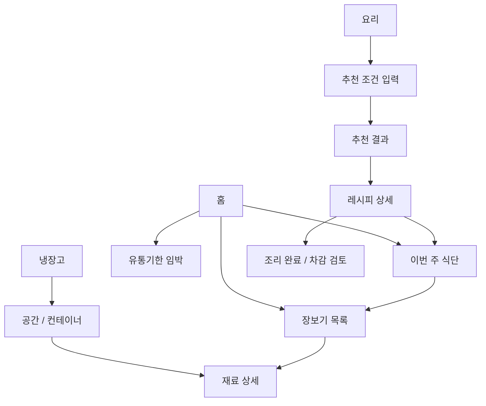

# Fridge Flow 제품 기획서

- 문서 상태: 초안 v0.3
- 작성일: 2026-07-29
- 대상: 제품 기획, 디자인, 앱·백엔드·AI 개발
- 현재 단계: 구현 전

## 1. 제품 개요

Fridge Flow는 냉장고 속 재료의 **종류, 수량, 보관 위치, 유통기한**을 한눈에 보여주고, 이를 **레시피 추천, 주간 식단, 장보기, 자동 재고 차감**으로 연결하는 앱이다.

핵심 경험은 다음 한 문장으로 설명한다.

> “지금 무엇이 있고, 어디에 있으며, 무엇을 해 먹을 수 있고, 다음에 무엇을 사야 하는지”를 한 곳에서 해결한다.

AI는 요리를 제안하고 사용자의 요구에 맞게 레시피를 구성하지만, 재고와 수량 계산 같은 사실 데이터는 규칙 기반 시스템이 관리한다.

## 2. 해결할 문제

사용자는 다음과 같은 단절을 겪는다.

1. 냉장고에 무엇이 있는지 기억하지 못해 중복 구매하거나 재료를 버린다.
2. 재료가 냉장실, 냉동실, 서랍, 용기 중 어디에 있는지 찾기 어렵다.
3. 가진 재료로 무엇을 만들 수 있는지 판단하는 데 시간이 든다.
4. 식단을 짜도 필요한 재료와 현재 재고의 차이를 다시 계산해야 한다.
5. 요리 후 실제 사용량을 재고에서 일일이 빼야 해서 기록이 금방 틀어진다.
6. 일반적인 레시피 추천은 알레르기, 다이어트, 조리 시간, 선호를 충분히 반영하지 못하거나 반복적이다.
7. 영양성분과 칼로리의 출처와 신뢰 수준이 불분명한 경우가 많다.

Fridge Flow는 “재고 등록 → 위치·기한 파악 → 요리/식단 선택 → 장보기 → 조리 → 재고 차감”을 하나의 닫힌 순환으로 만든다.

## 3. 목표 사용자

### 3.1 1차 사용자

- 1~2인 가구로 식재료를 자주 남기는 사람
- 냉장고 재료를 기반으로 빠르게 한 끼를 결정하고 싶은 사람
- 주간 식단이나 다이어트 식단을 계획하는 사람
- 냉장·냉동실 안에서 재료 위치를 자주 잊는 사람

### 3.2 이후 확장 사용자

- 알레르기나 특정 식단 원칙이 있는 사용자
- 여러 저장 공간(김치냉장고, 팬트리 등)을 관리하는 사용자

### 3.3 대표 사용자 상황

- “퇴근했는데 지금 있는 재료로 20분 안에 만들 수 있는 저녁이 필요하다.”
- “이번 주 다이어트 식단을 짜고 부족한 것만 사고 싶다.”
- “두부가 있었던 것 같은데 어느 칸에 있는지 모르겠다.”
- “유통기한이 먼저 끝나는 재료부터 소비하고 싶다.”

## 4. 제품 원칙

1. **한눈에 보인다.** 홈과 냉장고 화면에서 중요 정보가 스크롤과 검색을 최소화해 드러나야 한다.
2. **1분 안에 관리한다.** 흔한 재료의 등록 또는 수정은 60초 이내에 끝나야 한다.
3. **로컬에서 즉시, 서버에서 안전하게.** 저장된 재고, 레시피, 식단, 장보기 목록은 로컬 DB에서 즉시 표시하고 변경도 낙관적으로 반영한다. 인증된 계정 데이터는 백그라운드에서 서버와 동기화한다.
4. **AI는 제안하고 사용자가 결정한다.** 추천 전 의도를 확인하고, 자동 차감이나 일괄 변경은 검토·되돌리기가 가능해야 한다.
5. **계산과 생성은 분리한다.** 수량, 부족분, 영양 합계는 검증 가능한 로직이 계산하고 AI는 결과를 임의로 바꾸지 않는다.
6. **신뢰도를 보여준다.** 영양 값의 출처, 대체재, 추정치와 불확실성을 숨기지 않는다.
7. **반복을 줄이되 익숙함은 보존한다.** 최근 추천을 무조건 반복하지 않으며, 사용자가 좋아하고 저장한 요리는 적절한 간격으로 다시 제안한다.

## 5. 목표와 성공 지표

### 5.1 제품 목표

- 사용자가 실제 재고를 빠르고 정확하게 유지하게 한다.
- 보유 재료의 활용률을 높이고 유통기한 경과 폐기를 줄인다.
- “오늘 뭐 먹지?”에서 실행 가능한 레시피 결정까지의 시간을 줄인다.
- 주간 식단에서 필요한 장보기와 조리 후 차감을 자동 연결한다.

### 5.2 핵심 성공 지표

| 지표 | MVP 목표 | 측정 방법 |
|---|---:|---|
| 재료 등록 완료 시간 | 중앙값 60초 이하 | 등록 시작~저장 이벤트 |
| 재료 수정 완료 시간 | 중앙값 30초 이하 | 상세 진입~저장 이벤트 |
| 첫 재료 등록 성공률 | 90% 이상 | 등록 시작 대비 완료 |
| 홈 로컬 표시 시간 | 앱 시작 후 1초 이내 목표 | 콜드 스타트 성능 로그 |
| “바로 조리 가능” 추천 적합률 | 상위 5개 중 4개 이상이 수량까지 충족 | 평가 데이터셋 + 사용자 피드백 |
| 부족 재료 계산 정확도 | 알려진 단위 범위에서 99% 이상 | 자동화된 계산 테스트 |
| 추천 다양성 | 최근 7일 추천 상위 5개의 중복률 30% 이하 | 추천 노출 로그 |
| 차감 신뢰성 | 중복 차감 0건, 7일 내 모든 차감 undo 가능 | 로컬 거래·활동 로그 |
| 식단→장보기 전환 | 식단 생성 사용자의 60% 이상 | 장보기 목록 생성 이벤트 |
| 백업 복원 성공률 | 호환되는 정상 백업 파일 100% | 자동 백업→초기화→복원 E2E |
| 동기화 신뢰성 | 승인된 mutation 유실·중복 적용 0건 | offline outbox→재연결 E2E |
| 계정 격리 | 다른 계정 데이터 노출 0건 | API authorization·DB 격리 테스트 |
| AI 비용 상한 | 설정한 일·월 한도 초과 0건 | FastAPI quota 집계 |

실사용을 시작한 뒤에는 4주 사용 지속률, 주간 식단 완료율, 유통기한 임박 재료 소비/폐기 표시율을 장기 지표로 추가한다.

## 6. 범위

### 6.1 MVP에 포함

- 재료 등록, 조회, 수정, 삭제
- 재료 수량·단위, 구매일, 유통기한, 메모
- 냉장고/냉동고/팬트리의 구역 및 컨테이너 생성
- 컨테이너 배치와 재료 드래그 이동
- 유통기한 임박/경과 표시와 정렬
- 가진 재료 기준 “바로 가능” 및 “조금만 사면 가능” 레시피
- 추천 요청 전 식단 목적·제외 재료·조리 시간·인분 입력
- 레시피 상세, 영양성분, 저장/좋아요/싫어요
- 주간 식단 등록과 인분 조정
- 재고를 반영한 부족 재료 및 장보기 목록 계산
- 장보기 체크박스와 구매한 항목의 재고 등록 보조
- 조리 완료 후 예상 차감 내역 확인, 적용, 실행 취소
- 홈의 이번 주 식단, 장보기 진행률, 유통기한 임박 재료
- Google 로그인과 서버 초대 목록 기반 최초 가입
- 계정별 Neon PostgreSQL 저장과 로컬 SQLite 양방향 동기화
- 오프라인 변경 outbox, 재연결 동기화와 기본 충돌 처리
- 백업 폴더 지정, 수동 백업, 일 1회 자동 백업, 계정 단위 파일 복원
- Firebase App Distribution을 통한 초대 기반 Android 배포

### 6.2 MVP 이후

- 바코드/영수증/OCR 기반 빠른 등록
- `expo-notifications` 기반 기기 내 유통기한·식단 예약 알림과 사용자별 알림 시간 설정
- 알림은 사용자가 기능을 켤 때 권한을 요청하고, 기본값은 임박 재료 일 1회 요약으로 제한한다.
- 서버 push token·FCM·상시 scheduler는 도입하지 않는다. 원격 알림 필요성이 실제로 확인될 때 별도 검토한다.
- 가격 비교, 마트/배달 장바구니 연동
- 냉장고 사진 인식과 자동 재료 추출
- 음성 등록 및 음성 조리 모드
- 웨어러블/건강 앱 연동
- 고급 영양 목표와 전문가용 기능

### 6.3 의도적으로 제외

- 의료 진단 또는 치료 목적의 식단 처방
- AI가 사용자 확인 없이 재고를 영구 변경하는 기능
- 음식의 실제 안전 여부를 유통기한만으로 판정하는 기능
- MVP 단계의 정밀한 3D 냉장고 모델링
- 모든 부피·무게·개수 단위의 임의 자동 변환

## 7. 정보 구조와 주요 화면

하단 탭은 다섯 개를 기본으로 한다.

1. **홈**: 오늘/이번 주 식단, 장보기 진행률, 임박 재료, 빠른 추천
2. **냉장고**: 공간·컨테이너 시각화, 재료 목록, 검색/필터
3. **요리**: 바로 가능, 조금만 사면 가능, 저장 레시피, 추천 요청
4. **식단**: 주간 캘린더, 끼니 배치, 인분, 필요한 재료
5. **더보기**: 사용자 선호, 알레르기, 백업·복원, AI 사용 가능 상태, 데이터 출처

화면 이동의 기본 구조:

## 8. 핵심 사용자 흐름

### 8.0 초대와 로그인

1. 운영자가 사용할 사람의 Google 이메일을 서버 초대 목록에 등록한다.
2. 사용자는 앱 시작 화면에서 `Google로 계속하기`를 선택한다.
3. Google이 확인한 이메일이 초대 목록과 일치하면 첫 로그인 시 계정을 자동 생성한다.
4. 초대되지 않은 이메일은 계정을 만들지 않고 접근을 거부한다.
5. Google 로그인 상태는 기기에서 안전하게 유지되며, 앱은 만료된 ID token을 갱신해 다시 열 때 로그인을 지속한다.
6. 첫 로그인 또는 재설치 시 서버 데이터를 내려받아 로컬 DB를 구성한다.

### 8.1 재료 등록

1. 냉장고 화면에서 `+ 재료`를 누른다.
2. 재료명을 검색하거나 직접 입력한다.
3. 최근 사용값을 바탕으로 수량, 단위, 위치가 미리 제안된다.
4. 유통기한은 선택 입력이며 `없음/모름`을 명시할 수 있다.
5. 저장 즉시 기기 SQLite에 반영되고 화면에 나타난다.

빠른 등록에서는 이름, 수량, 위치만으로 저장할 수 있다. 상세 정보는 나중에 보완한다.

### 8.2 위치 확인과 드래그 이동

1. 사용자가 냉장고의 공간(냉장실/냉동실/팬트리)과 컨테이너를 본다.
2. 재료 카드를 길게 눌러 다른 컨테이너로 드래그한다.
3. 놓는 즉시 위치가 로컬에 반영된다.
4. 잘못 이동했을 때 스낵바에서 실행 취소할 수 있다.

컨테이너 위치는 행·열 기반 격자 좌표와 칸 단위 크기로 저장해 화면 크기가 달라도 배치를 안정적으로 재현한다. 재료 자체는 MVP에서 컨테이너 안의 정렬 순서까지만 관리한다.

### 8.3 지금 먹을 요리 추천

1. 사용자가 `지금 뭐 먹지?`를 누른다.
2. 앱이 다음을 짧은 칩/입력으로 확인한다.
   - 목적: 일반식, 다이어트, 고단백, 가볍게 등
   - 끼니와 인분
   - 최대 조리 시간
   - 제외할 재료/알레르기
   - 꼭 쓰고 싶은 재료
3. 시스템이 재고와 수량으로 후보를 먼저 계산한다.
4. 결과를 `바로 가능`과 `재료 1~3개 추가`로 나눠 보여준다.
5. 사용자는 추천 이유, 부족 재료, 예상 시간, 영양 요약을 보고 선택한다.
6. 상세 레시피 생성이 필요한 경우에만 AI가 사용자 조건과 검증된 후보 데이터를 이용한다.

### 8.4 주간 식단과 장보기

1. 사용자가 직접 레시피를 배치하거나 목표를 입력해 주간 식단 초안을 받는다.
2. 요일/끼니/인분을 수정한다.
3. 시스템이 전체 필요량을 합산하고 현재 재고의 사용 가능한 양을 뺀다.
4. 부족분을 재료별로 합쳐 장보기 목록을 만든다.
5. 사용자는 이미 집에 있는 항목을 제외하거나 수량을 수정한다.
6. 구매 체크 시 바로 재고에 추가할지 묻는다.

### 8.5 조리와 자동 차감

1. 레시피에서 `요리 시작` 후 `조리 완료`를 누른다.
2. 앱이 재료별 예상 사용량과 차감될 재고 묶음을 보여준다.
3. 사용자는 실제 사용량 또는 대체 재료를 수정한다.
4. 확인하면 하나의 원자적 거래로 차감한다.
5. 완료 직후 10초 동안 실행 취소 스낵바를 표시한다.
6. 활동 기록에서는 차감 후 7일 동안 실행 취소할 수 있다.

재고가 여러 묶음이면 기본적으로 유통기한이 빠른 순서(FEFO)로 차감한다.
7일이 지나면 차감 기록을 직접 취소하지 않고 재고 수량 조정으로 바로잡는다. 차감과 실행 취소 기록은 기간과 관계없이 보존한다.

## 9. 기능 요구사항

### 9.1 재고 관리

- 한 재료를 구매 묶음(batch)별로 관리한다. 같은 우유라도 유통기한이 다르면 별도 묶음이다.
- 목록에서는 같은 재료의 총량을 합쳐 보여줄 수 있지만 상세에서는 묶음을 구분한다.
- 필수 필드: 이름, 수량, 단위, 위치
- 선택 필드: 카테고리, 구매일, 유통기한, 개봉일, 최소 보유량, 메모
- 기본 단위는 `g`, `kg`, `ml`, `L`, `개`이며 포장 단위로 `팩`, `봉`, `병`, `캔`을 제공한다.
- 재료별 기본 단위와 최근 입력 단위를 우선 표시하고 숫자 직접 입력 및 `+`/`-` 빠른 조절을 지원한다.
- 소수 수량을 허용하며 `1팩 300g`처럼 포장 개수와 실제 용량을 함께 기록할 수 있다.
- 정확한 양을 모를 때는 `수량 모름`으로 등록할 수 있다. 이 재료는 보유 여부에는 반영하지만 `바로 조리 가능` 판정에는 수량 확인 필요로 표시한다.
- 상태: 보유, 소진, 폐기, 삭제
- 검색: 이름, 별칭, 카테고리
- 필터: 공간, 컨테이너, 임박, 개봉, 수량 부족
- 수량 0은 삭제가 아니라 소진 기록으로 남긴다.

### 9.2 공간과 컨테이너

- 기본 공간: 냉장실, 냉동실, 실온/팬트리
- 첫 설정에서 냉장실, 냉동실, 문 선반, 야채 서랍, 팬트리로 구성된 기본 템플릿을 제공한다.
- 사용자가 공간, 선반, 서랍, 바구니, 용기를 추가/이름 변경/재배치할 수 있다.
- 컨테이너는 상위 공간 또는 다른 컨테이너를 부모로 가질 수 있다.
- 편집 모드에서 컨테이너를 격자 단위로 이동·크기 조절하며 서로 겹치거나 화면 밖으로 벗어나지 않게 한다.
- 완전한 픽셀 단위 자유 배치는 제공하지 않는다.
- 컨테이너 내부 재료는 카드 또는 목록으로 자동 정렬하고 컨테이너 사이 이동만 드래그로 처리한다.
- 삭제할 컨테이너에 재료가 있으면 이동 위치를 먼저 선택한다.
- 드래그가 어려운 사용자를 위해 재료 상세의 위치 선택 목록도 제공한다.

### 9.3 유통기한

- 날짜 필드 이름은 제품 표기 종류와 관계없이 `유통기한` 하나로 통일한다.
- 유통기한은 선택 입력이며 빈 값(`null`)을 허용한다.
- 기본 구간은 `경과`, `오늘`, `3일 이내`, `7일 이내`, `그 이후`, `없음/모름`이다.
- 임박 기준은 사용자가 설정할 수 있다.
- 홈에서는 가장 급한 재료를 우선하며 같은 날짜에서는 개봉한 재료를 먼저 표시한다.
- 날짜가 없는 재료는 임박 알림에서 제외하고 FEFO 차감 시 날짜가 있는 묶음 뒤에 배치한다.
- 소비, 폐기, 기한 수정 액션을 바로 제공한다.
- 날짜가 지났다는 사실과 음식이 안전하지 않다는 판정을 동일시하지 않는다.

### 9.4 레시피와 추천

- 초기 기본 카탈로그는 식품의약품안전처 조리식품 레시피 공공 DB에서 가져온다.
- 공공 레시피는 빌드 과정에서 읽기 전용 `catalog.db`로 만들고 메뉴명, 재료, 단위, 조리 단계, 영양, 이미지와 원본 ID를 정규화한다.
- 재료와 단위를 신뢰성 있게 분석한 레시피만 재고 수량 기반 `바로 가능` 및 `조금만 사면 가능` 판정에 사용한다.
- 분석이 불완전한 레시피는 일반 검색에는 표시할 수 있지만 재고 충족을 확정적으로 표시하지 않는다.
- 기존 카탈로그에 적합한 결과가 없거나 사용자가 새로운 요리를 요청할 때만 AI가 레시피 초안을 만든다.
- AI 레시피는 검증 후 사용자 전용 레시피로 저장·수정할 수 있으며 공공 레시피와 출처를 구분한다.
- 블로그, 동영상, 상업 레시피 사이트의 콘텐츠를 허가 없이 수집하지 않는다.
- 식약처 공공 레시피가 제공하는 이미지 URL만 사용하고 처음 표시할 때 앱 캐시에 내려받는다.
- 이미지가 없거나 오프라인 cache miss이면 기본 요리 placeholder를 표시하며 추천 기능은 계속 동작한다.
- 이미지 cache는 최대 150MB LRU로 관리하고 백업에는 포함하지 않는다.
- AI 생성 레시피는 초기 버전에서 별도 이미지를 만들지 않고 placeholder를 사용한다.

추천 결과는 다음을 포함한다.

- 이름, 한 줄 설명, 이미지(있을 경우)
- 인분, 준비/조리 시간, 난이도
- 재고 충족률
- 보유 재료와 부족 재료
- 우선 소비 재료 사용 여부
- 칼로리와 주요 영양성분 요약
- 추천 이유
- 저장, 식단에 추가, 싫어요/숨기기

추천 후보군은 다음 두 그룹이다.

- **바로 가능**: 필수 재료가 모두 있고 수량까지 충족
- **조금만 사면 가능**: 핵심 재료는 있고 부족 재료가 기본 3종 이하이거나 설정한 비용/개수 한도 이내

소금, 물, 식용유 같은 기본 양념은 사용자 설정에 따라 `항상 있음`으로 취급할 수 있다.

### 9.5 추천 다양성

매 요청마다 무작위로 바꾸는 방식이 아니라 관련성과 다양성을 함께 점수화한다.

- 재고 일치율과 임박 재료 활용도를 우선한다.
- 최근 7일 노출/조리한 레시피와 매우 유사한 후보는 감점한다.
- 주요 단백질, 조리법, 음식 종류가 연속으로 반복되면 감점한다.
- 저장/좋아요, 실제 조리, 싫어요를 서로 다른 강도로 학습한다.
- 추천 결과 중 최소 1개는 사용자의 익숙한 취향, 최소 1개는 새로운 선택이 되도록 구성한다.
- “왜 추천했는지”를 사용자에게 짧게 설명한다.

### 9.6 레시피 상세와 영양

- 재료는 수량·단위·필수/선택 여부·대체재를 포함한다.
- 조리 단계는 순서, 시간, 주의점을 포함한다.
- 영양은 1인분 기준 열량, 탄수화물, 단백질, 지방, 나트륨을 우선 표시한다.
- 값은 가능한 경우 식품의약품안전처 K-FIND/공공데이터의 식품영양성분 DB를 우선 사용한다.
- K-FIND 다운로드 DB를 빌드 과정에서 정규화하고 앱에 필요한 공통 재료·레시피 범위만 읽기 전용 `catalog.db`에 포함한다.
- 3개월마다 새 버전을 확인하되 사용자는 새 APK를 설치할 때 갱신된 카탈로그를 받는다.
- 사용자 요청 시 K-FIND 외부 API를 실시간 호출하지 않는다.
- 매칭되지 않은 재료는 영양 값을 임의로 만들지 않고 `정보 없음` 또는 명시적인 추정으로 표시한다. USDA 보완 데이터는 다음 카탈로그 빌드에 반영할 수 있다.
- 전체 K-FIND 원본 DB를 앱에 그대로 포함하거나 재배포하지 않는다.
- 각 결과에 출처, 기준 중량, 계산 시각, 추정 여부를 저장한다.
- 사용자 입력량과 조리 손실에 따라 실제 섭취량이 달라질 수 있음을 표시한다.

참고 데이터:

- [K-FIND 식품영양성분 Open API 안내](https://various.foodsafetykorea.go.kr/nutrient/industry/openApi/info.do)
- [USDA FoodData Central API](https://fdc.nal.usda.gov/api-guide/)
- [식약처 조리식품 레시피 DB](https://www.data.go.kr/data/15060073/openapi.do)

### 9.7 식단 계획

- 주간 기준은 사용자의 로케일과 주 시작 요일 설정을 따른다.
- 날짜별 아침/점심/저녁/간식을 지원한다.
- 레시피, 직접 입력 메뉴, 외식/건너뜀을 등록할 수 있다.
- 인분 변경 시 필요한 재료와 영양 합계가 다시 계산된다.
- AI 식단 초안 생성 전 기간, 인원, 목표, 예산/시간, 제외 조건을 확인한다.
- 변경된 식단은 장보기 부족분과 연결되어 즉시 다시 계산된다.

### 9.8 장보기

- 같은 재료는 여러 레시피의 필요량을 합친다.
- 현재 사용 가능한 재고와 식단에 이미 예약된 수량을 반영한다.
- 카테고리별 정렬과 수동 순서 변경을 지원한다.
- 각 항목은 체크, 수량 수정, 삭제, 메모가 가능하다.
- 체크한 구매 항목은 재고 등록 화면으로 연결하며 위치와 유통기한을 추가로 받는다.
- 식단에서 자동 생성된 항목과 사용자가 직접 추가한 항목을 구분한다.

### 9.9 홈

홈의 우선순위는 “오늘 행동할 것”이다.

1. 오늘 및 다음 식단
2. 유통기한이 오늘이거나 3일 이내인 재료
3. 장보기 완료율과 미구매 핵심 항목
4. 임박 재료를 활용하는 빠른 추천
5. 동기화·백업 실패 또는 AI 일일 한도 도달 등 사용자가 알아야 할 상태

각 카드는 세부 화면으로 이동하지 않고도 최소 한 가지 핵심 액션을 제공한다.

### 9.10 계정, 동기화, 백업과 복원

- 앱 시작에는 Google 로그인이 필요하다.
- 공개 회원가입은 제공하지 않으며 서버 초대 목록에 등록된 Google 이메일만 첫 로그인 시 계정을 생성한다.
- 초대 삭제·취소는 아직 가입하지 않은 사람의 최초 가입만 차단하며 기존 계정을 자동 정지하지 않는다.
- 기존 사용자 접근을 차단할 때는 계정을 `suspended`로 전환한다. 정지 중에는 동기화·복원·AI API를 사용할 수 없지만 서버 데이터는 보존하고, 다시 활성화하면 그대로 사용할 수 있다.
- 사용자별 재고, 공간, 저장 레시피, 식단, 장보기, 선호와 활동 기록의 서버 원본은 Neon PostgreSQL이다.
- `user.db`는 즉시 표시, 오프라인 작업과 동기화 대기를 위한 로컬 replica다.
- 기본 재료, 공공 레시피와 영양 스냅샷은 앱과 함께 배포되는 읽기 전용 `catalog.db`에서 조회한다.
- 로그인과 최초 동기화가 한 번 완료된 뒤에는 AI 생성 이외의 핵심 기능을 오프라인에서도 사용할 수 있다.
- 로컬 변경은 즉시 화면에 반영하고 outbox에 기록한다. 네트워크가 연결되면 인증된 API를 통해 자동 전송한다.
- 서버 변경은 마지막 `sync_cursor` 이후의 변경분만 받고 계정별로 격리한다.
- 일반 수정 충돌은 `base_version`으로 감지하며, 재고 차감·undo는 중복 방지 키가 있는 append-only 거래로 적용한다.
- 홈과 설정에 마지막 동기화 시각, 대기 중인 변경 수와 오류 상태를 표시한다.
- 로그아웃 전에 미동기화 outbox를 확인하고 먼저 동기화를 시도한다. 실패하면 로그아웃 취소와 미전송 변경 손실 경고 중 사용자가 선택하게 한다.
- 정상 로그아웃하면 해당 계정의 `user.db`와 인증 정보를 기기에서 삭제한다. 공공 `catalog.db`와 공개 레시피 이미지 캐시는 유지한다.
- 한 기기에는 한 번에 한 계정의 로컬 replica만 유지하며 다시 로그인하면 Neon에서 전체 bootstrap한다.
- 설정에서 `계정 및 모든 데이터 삭제`를 제공한다. 삭제 전 선택적 `.ffbackup`, Google 재인증, 삭제 항목 요약과 2단계 확인을 거친다.
- 탈퇴를 확정하면 서버의 해당 계정과 모든 사용자 데이터를 하나의 transaction으로 즉시 삭제하고 로컬 DB·Google 로그인 상태도 제거한다.
- 개인 식별자가 제거된 전체 운영 집계만 유지할 수 있으며 사용된 초대는 복구하지 않는다. 다시 사용하려면 새 초대가 필요하고 삭제는 취소할 수 없다.
- Render 서버가 휴면 해제 중이면 기존 로컬 데이터는 즉시 보여주고 `서버를 시작하고 있어요` 상태를 표시한다.
- 첫 설치처럼 로컬 데이터가 없을 때만 로그인 후 최대 약 1분의 서버 준비 대기가 발생할 수 있음을 안내한다.
- 사용자는 Android 시스템 폴더 선택기를 통해 백업 폴더를 한 번 지정한다.
- `백업하기`는 지정 폴더에 `fridge-flow-YYYYMMDD-HHmmss.ffbackup` 파일을 즉시 생성한다.
- 앱을 실행한 날 아직 백업하지 않았다면 첫 로컬 변경 후 일 1회 자동 백업한다.
- 자동 백업은 최근 7개 일간 백업과 4개 주간 백업을 유지한다.
- 백업은 버전이 있는 JSON archive이며 manifest, schema version, 생성 시각과 SHA-256 checksum을 포함한다.
- 백업 파일은 암호화하지 않으며 개인 폴더 보관과 외부 공유 금지를 안내한다.
- `catalog.db`, API 키, 캐시, 로그와 빌드 자산은 백업에서 제외한다.
- `복원하기`는 로그인된 계정에서 Android 파일 선택기로 `.ffbackup` 파일을 고르고, 형식·버전·checksum을 검증한 뒤 복원 내용을 요약한다.
- 복원 직전에 현재 계정 데이터로 안전 백업을 만들고, MVP에서는 병합하지 않고 서버와 로컬의 해당 계정 데이터를 전체 교체한다.
- 복원 중 어느 단계라도 실패하면 서버 transaction을 rollback하고 기존 서버·로컬 데이터를 유지한다.
- 백업 폴더가 지정되지 않았거나 접근 권한이 사라졌다면 자동 백업 실패를 홈과 설정에 표시한다.

## 10. AI의 역할과 경계

### AI가 담당

- 자연어로 받은 식단 목적과 선호를 구조화
- 필터링된 후보 중 사용자 맥락에 맞는 순위 보조와 추천 이유 생성
- 조건에 맞는 레시피 초안 및 대체재 제안
- 주간 식단 초안 생성과 반복 완화
- 사용자의 피드백을 다음 추천에 반영할 특징으로 요약

### 일반 코드가 담당

- 현재 재고와 유통기한의 사실 판정
- 단위 호환성, 필요량·부족량·영양 합계 계산
- 장보기 병합
- 재고 차감 순서와 거래 처리
- 재고 거래, 계정 동기화, 백업과 복원
- 알레르기 금지 조건의 최종 검증

### AI 안전 원칙

- AI 호출 전에 알레르기와 하드 제외 조건으로 후보를 필터링하고, 출력 후 다시 검증한다.
- 모델 출력은 정해진 JSON 스키마를 통과해야 한다.
- AI가 임의로 만든 영양 수치를 저장하지 않는다. 앱의 결정론적 계산기가 `catalog.db` 재료-영양 매칭으로 계산한다.
- 사용자가 요청해도 위험한 보관/조리법을 확정적으로 안전하다고 표현하지 않는다.
- 개인 건강 목표는 참고용이며 의료 조언이 아님을 알린다.
- 모델, 프롬프트, 스키마 버전을 추천 기록에 저장해 품질을 추적한다.
- 초기 생성 모델은 `gpt-5.4-mini`로 운영하고, 대표 추천 데이터셋 평가 결과에 따라 서버 설정만 변경할 수 있게 한다.
- AI 함수는 생성에 전달된 요청 본문과 재고 subset을 로그나 별도 AI 저장소에 보관하지 않는다. 사용자가 저장한 검증 결과만 일반 계정 데이터로 서버와 로컬에 동기화한다.
- AI 사용량이 서버의 분·일·월 한도에 도달하면 추가 호출을 차단하고 규칙 기반 추천을 계속 제공한다.
- AI 요청 중 한도에 도달하면 즉시 원인과 예상 재설정 시각을 안내한다.
- 짧은 분당 한도는 `잠시 후 다시 시도해 주세요`, 일간 한도는 `오늘의 AI 사용 한도에 도달했어요`, 월간 한도는 `이번 달 AI 사용 한도에 도달했어요`로 구분한다.
- 한도가 유지되는 동안 홈과 요리 화면에 상태 배너를 표시하고 AI 버튼은 비활성화하되 로컬 추천 버튼은 계속 제공한다.
- kill switch 또는 운영 장애는 사용량 초과와 구분해 `AI 기능을 잠시 사용할 수 없어요`로 표시한다.

## 11. 우선순위와 구현 단계

### Phase 0 — 기반과 검증

- 클릭 가능한 핵심 화면 프로토타입
- 5~8명 사용성 테스트
- 재료 등록 60초 기준 검증
- 단위/수량/묶음 모델 확정
- 추천 평가용 대표 냉장고·사용자 조건 데이터셋 작성

### Phase 1 — 재고 MVP

- Google 로그인, 초대 목록과 계정 생성
- Neon 서버 DB, 인증된 재고 API와 계정 격리
- 로컬 DB, outbox/cursor 동기화와 재고 CRUD
- 공간/컨테이너와 드래그 이동
- 유통기한 화면과 홈 요약
- 백업 폴더 지정, 수동·자동 백업과 계정 전체 교체 복원

### Phase 2 — 레시피와 조리

- 검증된 기본 레시피 카탈로그
- 보유/부족 재료 계산과 후보 순위
- 추천 조건 입력과 AI 레시피 보조
- 저장/피드백/다양성
- 조리 완료 차감과 실행 취소

### Phase 3 — 식단과 장보기

- 주간 식단 편집
- 필요량 집계와 부족분 계산
- 장보기 체크 및 재고 연결
- AI 식단 초안

### Phase 4 — 소규모 실사용

- 인앱 상태 알림, 분석, 장애 대응
- 추천/영양 품질 평가
- 데이터 복원 훈련
- 본인 기기와 지인 기기에 Android 설치 파일 배포
- Firebase App Distribution 초대 명단과 새 빌드 전달 검증
- 실제 데이터로 백업·복원과 버전 업데이트 검증
- 오프라인 변경 후 재연결, 재설치 후 전체 동기화와 계정 격리 검증
- Render 휴면 상태에서 기존 사용자 로컬 진입과 신규 사용자 bootstrap 대기 UX 검증

## 12. MVP 완료 수용 기준

- 네트워크를 끊어도 기존 재고, 식단, 저장 레시피, 장보기 목록이 열린다.
- 재료를 저장하면 즉시 목록과 위치 화면에 나타난다.
- 초대되지 않은 Google 계정은 가입과 데이터 API 접근이 거부된다.
- 재설치 후 같은 Google 계정으로 로그인하면 서버 데이터가 복원된다.
- 오프라인에서 만든 변경이 재연결 후 한 번만 서버에 반영된다.
- 서로 다른 계정은 상대방의 데이터를 조회·수정할 수 없다.
- 앱을 삭제하기 전에 만든 백업 파일로 새 설치의 사용자 데이터를 복원할 수 있다.
- 복원 직전 자동 안전 백업이 만들어지고 잘못된 checksum 파일은 거부된다.
- 같은 재료의 유통기한이 다른 두 묶음을 독립적으로 관리한다.
- 레시피 인분을 바꾸면 필요량, 부족분, 영양 합계가 함께 갱신된다.
- `바로 가능` 레시피는 필수 재료의 호환 가능한 수량을 모두 충족한다.
- 조리 차감 전 변경 내역을 볼 수 있고, 적용 후 실행 취소할 수 있다.
- 같은 차감 요청을 재시도해도 한 번만 반영된다.
- 알레르기 하드 제외 조건을 위반하는 추천이 최종 결과에 노출되지 않는다.
- AI 또는 영양 API가 실패해도 재고와 식단 기능은 계속 동작한다.

## 13. 위험과 대응

| 위험 | 영향 | 대응 |
|---|---|---|
| 사용자가 재고 입력을 귀찮아함 | 데이터가 금방 부정확해짐 | 빠른 등록, 최근값, 구매→재고 연결, 이후 바코드/OCR |
| g/ml/개 단위 변환 오류 | 추천·장보기 수량이 틀림 | 호환 단위만 자동 변환, 재료별 밀도표 없으면 확인 요청 |
| AI 환각 레시피/영양 | 신뢰와 안전 저하 | 후보 제한, 구조화 출력, 규칙 검증, 영양 별도 계산 |
| 반복 추천 | 사용자가 추천을 무시함 | 최근 노출 감점, 조리법/주재료 다양성 제약 |
| 기기 분실·앱 삭제 | 최근 미동기화 변경 손실 | 즉시 로컬 저장, 자동 재시도, 동기화 상태 표시, 보조 파일 백업 |
| 손상·상위 버전 백업 | 복원 실패 또는 데이터 손상 | manifest/schema/checksum 검증, 복원 전 안전 백업, transaction rollback |
| 자동 차감 오차 | 실제 재고와 앱 불일치 | 차감 전 검토, FEFO, 수정, undo |
| 알림 과다 | 알림 해제/이탈 | 요약 알림, 사용자 임박 기준과 시간 설정 |
| AI endpoint 무단 호출 | 비용 발생 또는 정상 사용자의 한도 소진 | 인증, 사용자·전역 모델·입출력·동시성·분·일·월 한도와 긴급 차단 |
| 인증·인가 누락 | 계정 간 데이터 노출 | 모든 API의 Google ID token 검증, 서버에서 user scope 강제, 자동 격리 테스트 |
| 동기화 충돌·중복 | 데이터 유실 또는 재고 이중 차감 | base version, idempotency key, append-only 거래, 충돌 UI |
| Render 무료 서버 휴면 | 첫 로그인·동기화가 약 1분 지연 | 로컬 데이터 우선 표시, 서버 시작 안내, 긴 timeout과 동일 요청 재시도 |
| 초대 APK 재공유 | 허용하지 않은 사람이 앱 설치 | 배포 초대와 별개로 서버 Google 이메일 초대 목록에서 실제 접근 차단 |
| 외부 AI 장애 | 생성 기능 사용 불가 | 로컬 카탈로그와 규칙 기반 추천을 계속 제공 |

## 14. 확정된 제품 범위

핵심 기능과 시스템 방향 및 현재 기획 단계의 기술 선택은 확정되었다. 이후 제품 동작·비용·개인정보·데이터 보존·운영 범위를 바꾸는 결정만 사용자에게 확인하고, 나머지 구현 세부사항은 호환성 검증과 테스트 결과를 근거로 `TECHNICAL_DESIGN.md`의 결정 기록에 남긴다.

## 15. 제품 결정 기록

| 날짜 | 결정 | 이유 |
|---|---|---|
| 2026-07-29 | 로컬 우선 구조 채택 | API 응답 전 즉시 표시, 오프라인 사용, 백업 요구 충족 |
| 2026-07-29 | AI와 수량 계산 분리 | 정확성, 테스트 가능성, 장애 격리 |
| 2026-07-29 | 자동 차감에 검토와 undo 필수 | 재고 신뢰와 사용자 통제권 보장 |
| 2026-07-29 | 묶음 단위 재고 모델 채택 | 동일 재료의 서로 다른 유통기한과 위치 처리 |
| 2026-07-29 | 개인·지인용 Android만 제공 | 공개 출시 계획이 없으며 iOS와 앱스토어 운영 복잡도가 불필요함 |
| 2026-07-29 | 앱 시작부터 Google 로그인 필수 재채택 | 계정별 서버 동기화와 초대 사용자 접근 제어 |
| 2026-07-29 | 공유 냉장고 기능 제외 | 개인 계정별 데이터만 관리하고 냉장고 구성원 역할·공유 충돌 처리를 제외 |
| 2026-07-29 | 재료별 기본 단위와 빠른 수량 입력 | 단위 정확성을 유지하면서 1분 이내 등록 목표를 충족 |
| 2026-07-29 | 템플릿 + 격자 기반 냉장고 배치 | 모바일 편집 안정성과 컨테이너·재료 드래그 요구를 함께 충족 |
| 2026-07-29 | K-FIND 로컬 적재 + USDA 보완 | 외부 API 장애를 줄이고 출처가 있는 영양 계산을 빠르게 제공 |
| 2026-07-29 | 식약처 공공 레시피 + 검증된 AI 레시피 | 이용 제한 없는 기본 카탈로그를 확보하고 AI 호출과 환각을 줄임 |
| 2026-07-29 | 자동 차감 undo 7일, 기록 영구 보존 | 사용자의 정정 기회를 제공하면서 로컬 거래 이력의 일관성 유지 |
| 2026-07-29 | nullable 유통기한 단일 필드 | 입력을 단순화하고 날짜가 없는 재료도 자연스럽게 관리 |
| 2026-07-29 | 서비스명 `Fridge Flow` | 저장소와 앱 내 모든 표시를 영어명으로 통일 |
| 2026-07-29 | Neon PostgreSQL 계정별 서버 원본 | 적은 데이터량으로 무료 범위를 활용하면서 재설치·기기 변경 복구와 동기화 제공 |
| 2026-07-29 | 로컬 SQLite replica + outbox/cursor 동기화 | API 응답 전 즉시 표시와 오프라인 작업을 유지하면서 서버 원본과 수렴 |
| 2026-07-29 | Google 이메일 초대 목록 | 공개 회원가입 없이 허용된 지인만 최초 계정 생성 |
| 2026-07-29 | 초대와 계정 상태 분리 | 초대는 최초 가입에만 사용하고 기존 계정은 active/suspended로 안전하게 접근 제어 |
| 2026-07-29 | 로그아웃 시 로컬 계정 데이터 삭제 | 계정 간 데이터 혼합을 막고 서버 bootstrap으로 복구 가능 |
| 2026-07-29 | 기기당 단일 계정 replica | 로컬 DB 구조와 로그아웃·계정 전환을 단순하고 안전하게 유지 |
| 2026-07-29 | 회원 탈퇴 즉시 전체 삭제 | 선택적 백업·재인증·2단계 확인 후 서버와 로컬 데이터를 명확하게 제거 |
| 2026-07-29 | Firebase App Distribution 초대 배포 | 공식 빌드 전달 대상을 제한하고 서버 초대 목록으로 실제 접근을 추가 제한 |
| 2026-07-29 | FastAPI + Render API | 인증, 계정별 CRUD·동기화와 AI proxy를 하나의 Python API로 제공하고 무료 휴면을 수용 |
| 2026-07-29 | Render 무료 서버 cold start UX | 기존 로컬 데이터는 즉시 표시하고 신규 bootstrap에는 서버 시작 상태와 안전한 재시도 제공 |
| 2026-07-29 | Render·Neon Singapore 리전 | 한국 사용자 지연과 API↔DB 왕복 시간을 함께 최소화 |
| 2026-07-29 | 인증 + AI 사용량 상한 | 계정별 접근을 검증하고 별도의 비용 상한으로 키 유출·오남용 피해 제한 |
