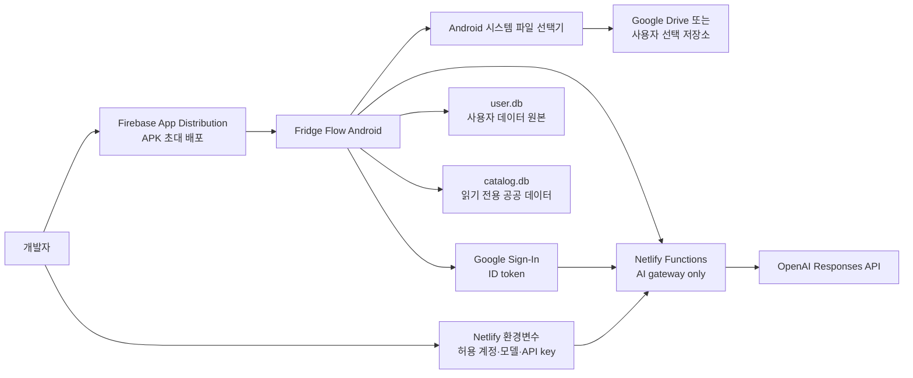
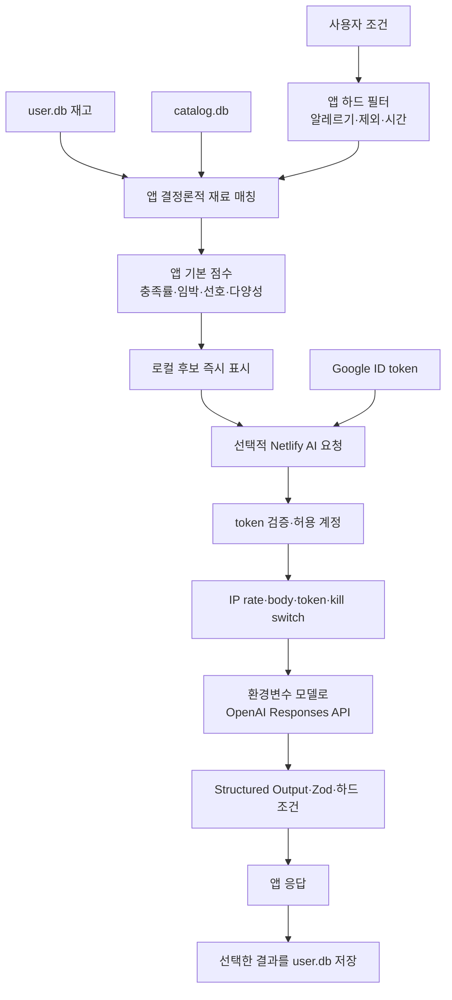

# Fridge Flow 기술 설계서

- 문서 상태: 초안 v0.6
- 작성일: 2026-07-29
- 최종 수정일: 2026-08-03
- 전제: `PRODUCT_SPEC.md`의 개인·지인용 Android MVP를 구현하기 위한 현재 설계

## 1. 설계 목표

- 사용자 데이터의 실행 원본은 Android 기기의 SQLite `user.db` 하나로 둔다.
- 중앙 사용자 DB, 서버 CRUD, 자동 동기화와 서버 계정 시스템을 운영하지 않는다.
- 재고·위치·식단·장보기·저장 레시피는 네트워크와 관계없이 즉시 동작하게 한다.
- 사용자가 내보낸 `.ffbackup`을 Android 시스템 파일 선택기로 Google Drive 또는 기기 저장소에 보관하고 전체 교체 방식으로 복원한다.
- OpenAI API key는 APK에 포함하지 않고 Netlify 환경변수로만 관리한다.
- Node.js 기반 Netlify Functions는 Google ID token 검증, AI 허용 계정 확인과 OpenAI 호출만 담당한다.
- 앱이 모델을 선택하지 못하게 하고 `OPENAI_MODEL` 환경변수로만 모델을 통제한다.
- AI가 실패하거나 차단되어도 로컬 카탈로그, 재고, 식단과 장보기 기능은 계속 동작한다.

## 2. 시스템 경계



데이터 소유권:

- `user.db`: 재고·공간·컨테이너·저장 레시피·식단·장보기·선호·활동 기록의 유일한 실행 원본
- `catalog.db`: 기본 재료, 정규화된 공공 레시피와 영양 스냅샷
- `.ffbackup`: 사용자가 Drive 또는 다른 저장소에 보관하는 이식 가능한 논리적 DB export
- Google 인증 저장소: Google 로그인 상태와 단기 token; SQLite와 백업에는 포함하지 않음
- Netlify Functions: 사용자 데이터를 저장하지 않는 stateless AI gateway
- OpenAI: 한 요청 처리에 필요한 최소 정보만 수신하며 요청은 `store: false`로 전송

Fridge Flow 서버에는 회원, 재고, 식단, 백업 파일과 동기화 상태를 저장하지 않는다. 앱 삭제 후 자동 복구도 제공하지 않으며 사용자가 마지막으로 내보낸 백업이 복구 기준이다.

## 3. 권장 기술 스택

### 3.1 Android 앱

| 영역 | 선택 | 이유 |
|---|---|---|
| 프레임워크 | Expo SDK 57 + React Native 0.86 + React 19.2.3 + TypeScript | Android 개발과 APK 배포가 간편하고 Expo 공식 호환 조합 유지 |
| 라우팅 | Expo Router | 파일 기반 라우팅과 typed route |
| 사용자 DB | expo-sqlite 57.0.1 `user.db` | 로컬 transaction, migration과 재시작 후 유지 |
| 카탈로그 DB | 번들 SQLite `catalog.db` | 공공 레시피·영양 정보를 오프라인 조회 |
| DB 접근 | Drizzle ORM 0.45.2 + Drizzle Kit 0.31.10 + repository 계층 | typed schema·migration·live query와 UI/SQL 분리 |
| 원격 요청 | `fetch` + 작은 AI client adapter | 원격 상태가 AI 요청뿐이므로 별도 서버 cache를 최소화 |
| UI 상태 | Zustand + React state | 화면 간 비영속 UI 상태와 컴포넌트 로컬 상태 분리 |
| 폼/검증 | React Hook Form + Zod | 빠른 입력과 백업·AI 응답 검증 |
| 제스처 | Gesture Handler + Reanimated | 컨테이너·재료 드래그 |
| 파일 접근 | Android Storage Access Framework | Drive를 포함한 문서 제공자로 백업 내보내기·가져오기 |
| 인증 저장 | expo-secure-store + Google auth client | ID token을 일반 SQLite와 분리 |
| 테스트 | Jest + `jest-expo` + RNTL, Maestro | 단위·컴포넌트·Android E2E |
| 빌드 | EAS Build `development`·`preview` profiles | 개발 build와 서명된 배포용 APK 생성 |

화면은 `user.db`와 `catalog.db`를 직접 원본으로 읽는다. Drizzle `useLiveQuery`로 관련 table 변경을 반영하며 write는 feature repository를 통해서만 수행한다.

Zustand는 냉장고 배치 편집, 선택, 필터와 식단 편집처럼 여러 컴포넌트가 공유하는 비영속 UI 상태에만 사용한다. 재고·레시피·식단과 인증 정보는 저장하지 않고 `persist` middleware도 사용하지 않는다.

- [Expo SQLite](https://docs.expo.dev/versions/latest/sdk/sqlite/)
- [Expo Router](https://docs.expo.dev/router/introduction/)
- [Android Storage Access Framework](https://developer.android.com/training/data-storage/shared/documents-files)
- [Drizzle ORM Expo SQLite](https://orm.drizzle.team/docs/sqlite/connect-expo-sqlite)

### 3.2 AI 전용 백엔드

| 영역 | 선택 | 이유 |
|---|---|---|
| 런타임 | Node.js 22 + TypeScript | 앱과 schema 언어를 통일하고 Netlify 기본 배포 흐름 사용 |
| 실행 환경 | Netlify Functions | 별도 서버 process와 DB 없이 요청 단위 AI gateway 운영 |
| 패키지 관리 | npm workspaces + `package-lock.json` | 앱·함수·공유 계약의 재현 가능한 설치 |
| Google 검증 | `google-auth-library` | ID token 서명·audience·issuer·만료 검증 |
| 입력 검증 | Zod strict schema | body 크기·문자열·배열·허용 필드 제한 |
| AI SDK | OpenAI JavaScript SDK / Responses API | 구조화된 레시피·식단 생성 |
| 출력 검증 | JSON Schema Structured Outputs + Zod 재검증 | 앱에 전달하기 전 계약과 하드 조건 확인 |
| 배포 | Git 연결 Netlify production deploy | 커밋 기반 자동 배포와 환경변수 관리 |
| 테스트 | Vitest | 인증·인가·schema·OpenAI adapter 단위/통합 테스트 |

Express, Next.js 서버, FastAPI, Render, Neon, Redis, object storage와 별도 인증 DB는 사용하지 않는다. Netlify Function은 사용자 CRUD·백업·복원을 제공하지 않는다.

- [Netlify Functions 시작하기](https://docs.netlify.com/build/functions/get-started/)
- [Netlify Functions 환경변수](https://docs.netlify.com/build/functions/environment-variables/)
- [Google backend ID token 검증](https://developers.google.com/identity/sign-in/web/backend-auth)

### 3.3 AI와 공공 데이터

| 영역 | 선택 |
|---|---|
| 생성 API | OpenAI Responses API |
| API key | Netlify의 `OPENAI_API_KEY` 환경변수 |
| 모델 | 초기 `gpt-5.4-mini`; `OPENAI_MODEL` 환경변수만 사용 |
| 요청 저장 | `store: false`; 함수 DB·파일·application log 저장 금지 |
| 출력 | JSON Schema Structured Outputs + Zod 재검증 |
| 레시피 원본 | 식약처 조리식품 레시피 DB |
| 영양 1차 | 식약처 K-FIND |
| 영양 보조 | USDA FoodData Central |
| 사용자 저장 | 검증된 결과를 Android `user.db`에만 저장하고 백업 export에 포함 |

- [OpenAI Responses 및 모델 가이드](https://developers.openai.com/api/docs/guides/latest-model)
- [OpenAI Structured Outputs](https://developers.openai.com/api/docs/guides/structured-outputs)
- [식약처 조리식품 레시피 DB](https://www.data.go.kr/data/15060073/openapi.do)
- [K-FIND Open API](https://various.foodsafetykorea.go.kr/nutrient/industry/openApi/info.do)
- [USDA FoodData Central API](https://fdc.nal.usda.gov/api-guide/)

## 4. 저장소 권장 구조

```text
fridge-flow/
├─ apps/
│  └─ mobile/
│     ├─ src/app/                 # Expo Router 화면
│     ├─ src/features/            # inventory, recipes, meal-plan, shopping
│     ├─ src/db/user/             # user.db schema, migrations, repositories
│     ├─ src/db/catalog/          # catalog.db read repositories
│     ├─ src/auth/                # Google 로그인·token 갱신·소유 계정 연결
│     ├─ src/backup/              # export, validate, restore, Drive picker adapter
│     ├─ src/ai/                  # Netlify AI client와 local fallback
│     └─ src/shared/
├─ netlify/
│  └─ functions/
│     ├─ _shared/                 # auth, env, errors, OpenAI adapter
│     ├─ ai-status.ts
│     ├─ ai-recommendations.ts
│     ├─ ai-recipes.ts
│     └─ ai-meal-plans.ts
├─ packages/
│  └─ contracts/                  # Zod request/response와 schema version
├─ tools/
│  └─ catalog/                    # 공공 recipe·nutrition import/build 도구
├─ assets/
│  └─ catalog.db
├─ docs/
├─ netlify.toml
├─ package.json
├─ package-lock.json
└─ AGENTS.md
```

앱과 함수는 `packages/contracts`의 요청·응답 schema를 공유한다. 보안상 클라이언트 검증을 신뢰하지 않으며 Function에서 항상 같은 schema와 하드 조건을 다시 검사한다.

## 5. 로컬 데이터 모델

### 5.0 현재 구현 범위

2026-08-03 기준 `user.db` 기반 구현에는 `LocalOwner`, `AppProfile`, `StorageSpace`, `Container` schema와 첫 migration이 포함된다. 앱 시작 시 migration gate를 통과한 뒤에만 화면을 표시하며 SQLite foreign key, WAL과 change listener를 활성화한다.

공간 생성 write는 feature repository와 Drizzle persistence adapter를 통해 transaction으로 실행한다. migration SQL은 테스트 전용 SQLite 엔진에서 제약조건과 cascade 동작을 검증한다. `InventoryBatch`, `InventoryTransaction`을 포함한 나머지 사용자 엔터티는 후속 기능 구현에서 별도 migration으로 추가한다.

### 5.1 `user.db` 원본

| 엔터티 | 핵심 필드 |
|---|---|
| LocalOwner | owner_sub_sha256, created_at, last_login_at |
| AppProfile | locale, timezone, preferences, allergy_flags |
| StorageSpace | id, name, type, sort_order |
| Container | id, space_id, parent_id, name, grid geometry |
| CustomIngredient | id, canonical_name, aliases, category, default_unit |
| InventoryBatch | id, ingredient_ref, container_id, amount, unit, quantity_known, expires_on, status |
| SavedRecipe | id, catalog_recipe_id, source_type, title, snapshot |
| RecipePreference | id, recipe_ref, signal, created_at |
| RecommendationHistory | id, recipe_ref, shown_at, selected, model, schema_version |
| MealPlan / MealSlot | id, week_start / date, meal_type, recipe_ref, servings, status |
| ShoppingList / ShoppingItem | id, required_amount, unit, checked, source |
| InventoryTransaction | id, batch_id, type, amount_delta, reason, operation_id, created_at |
| BackupHistory | id, created_at, destination_label, status, checksum |

모든 로컬 엔터티 ID는 앱이 생성한 UUID다. 공통 필드는 `created_at`, `updated_at`이며 동기화용 `server_version`, `sync_status`, outbox와 cursor는 두지 않는다.

`LocalOwner.owner_sub_sha256`는 Google ID token의 `sub`를 SHA-256한 값이다. raw `sub`, email과 token은 일반 DB와 백업에 저장하지 않는다. 로그인 계정 hash가 일치하지 않으면 현재 DB를 열지 않는다.

### 5.2 거래와 삭제

- 재고 수량은 `InventoryTransaction`의 append-only delta로 변경한다.
- 같은 `operation_id`에는 unique constraint를 두어 조리 완료 버튼 중복 탭과 재시도로 인한 이중 차감을 막는다.
- undo는 반대 delta transaction을 추가하고 원래 거래를 삭제하지 않는다.
- 앱은 조리 직후 10초, 활동 기록에서는 7일까지 undo를 허용한다.
- 7일 이후에는 새 `adjustment` transaction으로 정정한다.
- 중앙 동기화가 없으므로 일반 엔터티 삭제 tombstone은 필요하지 않다. 다만 undo가 필요한 변경은 활동 기록과 안전 snapshot을 유지한다.

### 5.3 `catalog.db`

| 엔터티 | 핵심 필드 |
|---|---|
| CatalogMetadata | schema_version, source_versions, built_at |
| Ingredient | id, canonical_name, aliases, category, default_unit |
| Recipe | id, source, source_recipe_id, title, servings, parse_status |
| RecipeIngredient | recipe_id, ingredient_id, amount, unit, optional |
| RecipeStep | recipe_id, step_order, instruction, minutes |
| NutritionFood | id, source, source_food_id, source_version, basis_amount, basis_unit |
| NutrientValue | nutrition_food_id, nutrient_code, amount, unit |

`catalog.db`는 읽기 전용이며 앱 업데이트 시 교체할 수 있다. 저장 레시피는 필요한 표시·복원을 위해 snapshot도 `SavedRecipe`에 함께 저장한다.

### 5.4 수량과 날짜

- 수량은 decimal 의미를 보존하는 `amount`와 `unit`으로 저장한다.
- 기본 단위는 g, kg, ml, L, 개, 팩, 봉, 병, 캔이다.
- 포장 단위는 `package_count`와 선택적인 `package_size`/`package_size_unit`을 함께 저장한다.
- `quantity_known=false`이면 임의의 0으로 바꾸지 않는다.
- 질량↔부피는 재료별 밀도 근거가 있을 때만 변환한다.
- `expires_on`은 nullable date이며 UI에서는 `유통기한`으로 표시한다.
- 시각은 UTC ISO 8601, 달력 날짜는 date 의미를 보존한다.

## 6. Google 로그인과 AI 접근 제어

### 6.1 앱 로그인과 로컬 소유자

1. 앱은 시작 시 Google 로그인을 요청한다.
2. 첫 정상 로그인에서 token의 `sub` hash를 `LocalOwner`에 연결한다.
3. 이후 같은 hash의 계정만 현재 `user.db`를 연다.
4. 다른 계정이면 기존 계정 재로그인 또는 백업 후 기기 데이터 초기화를 요구한다.
5. Google ID token은 secure storage/auth client가 관리하고 `user.db`, log와 `.ffbackup`에 넣지 않는다.
6. 로그인 상태를 갱신할 수 없는 오프라인 상황에서는 이미 연결된 기기의 핵심 로컬 기능을 허용한다. AI 호출에는 최신 token이 필요하다.

이 로컬 소유자 확인은 우발적인 계정 전환 노출을 막는 UX 방어다. 변조된 APK나 root 기기까지 막는 원격 보안 경계는 아니다.

### 6.2 Netlify Function 인증·인가

1. 앱은 server web client ID를 audience로 하는 Google ID token을 얻는다.
2. `Authorization: Bearer <id-token>`으로 AI endpoint를 호출한다.
3. Function은 `google-auth-library`로 서명, `aud`, `iss`, `exp`를 검증한다.
4. `email_verified=true`를 요구한다.
5. 검증된 `sub`를 `AI_ALLOWED_GOOGLE_SUBS`, 검증된 normalized email을 `AI_ALLOWED_GOOGLE_EMAILS`와 비교한다.
6. 둘 중 구성된 허용 목록 하나라도 일치할 때만 OpenAI를 호출한다.
7. 허용되지 않은 계정은 `403 AI_ACCOUNT_NOT_ALLOWED`, token 오류는 `401 AI_AUTH_INVALID`를 반환한다.

`sub` allowlist가 안정적인 1차 수단이다. email allowlist는 관리 편의를 위한 보조 수단이며 Gmail 또는 Google Workspace처럼 Google이 현재 소유권에 대해 authoritative한 계정으로 제한한다.

서버 session, refresh token, 회원 row와 초대 table은 만들지 않는다. 계정 허용·차단은 Netlify 환경변수를 수정하고 production을 다시 배포해 적용한다.

## 7. 백업과 복원

### 7.1 Google Drive 저장 방식

- MVP는 Google Drive REST API를 직접 호출하지 않는다.
- Android Storage Access Framework의 `ACTION_CREATE_DOCUMENT`에 해당하는 Expo/native adapter로 시스템 `파일 만들기` 화면을 연다.
- 사용자는 Google Drive, 기기 저장소 또는 설치된 다른 `DocumentsProvider`를 선택한다.
- Drive 앱과 Android가 사용자 인증과 업로드를 담당하며 Fridge Flow는 선택된 document URI에만 쓴다.
- 별도 Drive OAuth scope, Drive refresh token, 서비스 계정과 백엔드 파일 중계가 필요 없다.
- 복원은 `ACTION_OPEN_DOCUMENT`에 해당하는 파일 선택기로 `.ffbackup` URI를 받아 읽는다.

MVP는 사용자 주도 내보내기만 보장한다. 자동 Drive 백업, 백그라운드 업로드와 다중 기기 동기화는 제공하지 않는다.

### 7.2 파일 형식

확장자: `.ffbackup`

```text
fridge-flow-20260802-153000.ffbackup
├─ manifest.json
└─ data.json
```

`manifest.json` 필수 필드:

```json
{
  "format": "fridge-flow-backup",
  "format_version": 1,
  "schema_version": 1,
  "app_version": "0.1.0",
  "owner_sub_sha256": "hex-string",
  "created_at": "2026-08-02T06:30:00Z",
  "record_counts": {},
  "data_sha256": "hex-string"
}
```

포함:

- 사용자 설정, 공간·컨테이너·재고와 거래 기록
- 저장 레시피와 AI 생성 레시피 snapshot
- 식단·장보기·추천 피드백
- 백업 기록을 제외한 필요한 사용자 도메인 데이터

제외:

- `catalog.db`
- Google ID/access/refresh token과 raw email·`sub`
- OpenAI API key, Netlify 환경변수와 서버 설정
- AI 요청 원문, application log와 임시 cache
- Drive document URI와 기기 전용 경로

백업은 암호화하지 않고 checksum으로 손상만 검증한다. 개인 Drive 폴더 보관과 외부 공유 금지를 설정·완료 화면에 안내한다.

### 7.3 생성과 복원

내보내기:

1. 하나의 SQLite read transaction으로 일관된 logical snapshot을 만든다.
2. schema와 레코드 수를 검사하고 `data.json` SHA-256을 계산한다.
3. 시스템 파일 선택기에 timestamp 파일명을 제안한다.
4. 선택된 URI에 임시/완료 순서로 쓰고 provider가 성공을 반환한 뒤 `BackupHistory`를 기록한다.
5. 홈과 설정에 마지막 성공 백업 시각을 표시하고 7일 이상이면 안내한다.

복원:

1. 시스템 파일 선택기에서 `.ffbackup`을 고른다.
2. archive traversal, 압축 해제 크기, format/schema version과 SHA-256을 검사한다.
3. 로그인 계정의 `sub` hash와 manifest 소유자 hash가 같은지 확인한다.
4. 백업 시각과 교체될 레코드 수를 요약하고 전체 교체를 확인받는다.
5. 현재 DB의 기기 내부 `pre-restore` 안전 snapshot을 만든다.
6. 임시 SQLite DB에 import하고 FK·UUID·수량·단위·거래 unique constraint를 검사한다.
7. 모든 검증이 끝난 뒤 앱이 현재 DB handle을 닫고 임시 DB와 원자적으로 교체한다.
8. 실패하면 임시 DB를 폐기하고 기존 `user.db`를 유지한다.

현재 앱보다 높은 schema version은 거부하고 업데이트 필요 메시지를 표시한다. 낮은 버전은 순차 migration fixture를 통과한 뒤 복원한다. 병합 복원은 제공하지 않는다.

## 8. 공공 카탈로그 빌드

- 식약처 레시피와 K-FIND 데이터를 개발 도구로 가져와 정규화한다.
- 레시피 재료 parse 상태를 `verified`, `partial`, `failed`로 나눈다.
- `verified`만 수량 기반 추천 후보로 사용하고 `partial`은 일반 검색에만 표시한다.
- 출처 ID, 기준량, source version과 import 시각을 보존한다.
- `catalog.db`에는 공공 이미지 URL만 두고 image binary는 넣지 않는다.
- 이미지 cache는 최대 150MB LRU이며 백업에서 제외한다.
- AI가 영양 값을 직접 생성하지 않는다.
- 3개월마다 원본 버전을 확인하고 schema·출처·참조 무결성 검사를 통과한 `catalog.db`만 APK 업데이트로 배포한다.

## 9. 추천 및 AI 파이프라인



AI 요청에는 구조화된 사용자 조건, 선택된 후보 또는 필요한 재료 subset, 허용·제외 재료와 schema version만 포함한다. 사용자 이름, email, Google token, 기기 파일과 전체 DB는 OpenAI에 전달하지 않는다.

OpenAI 요청의 `safety_identifier`에는 Google `sub`를 `AI_ID_HASH_SECRET`으로 HMAC한 privacy-preserving 값을 사용한다. 원본 `sub`는 OpenAI 요청과 log에 넣지 않는다.

### 9.1 출력 계약

```json
{
  "title": "string",
  "servings": 2,
  "ingredients": [
    {
      "ingredient_id": "catalog-id-or-null",
      "name": "string",
      "amount": 100,
      "unit": "g",
      "optional": false
    }
  ],
  "steps": [
    {
      "order": 1,
      "instruction": "string",
      "minutes": 5
    }
  ],
  "recommendation_reason": "string",
  "warnings": []
}
```

Function은 Zod strict schema와 알레르기·제외 조건으로 다시 검증한다. 실패 시 제한된 수정 요청을 한 번만 시도하고 다시 실패하면 `502 AI_OUTPUT_INVALID`를 반환한다.

## 10. Netlify AI API와 비용 방어

### 10.1 endpoint

| Method | Path | 목적 |
|---|---|---|
| GET | `/api/ai/status` | token·허용 계정과 kill switch 상태 확인 |
| POST | `/api/ai/recommendations` | 로컬 후보 개인화와 추천 이유 |
| POST | `/api/ai/recipes` | 새 레시피 초안 |
| POST | `/api/ai/meal-plans` | 주간 식단 초안 |

재고 CRUD, 계정 생성, sync, backup upload와 restore endpoint는 만들지 않는다. 모든 AI endpoint는 Google ID token을 검증한다.

앱이 request에 `model`, `api_key`, `user_id`를 보내면 strict schema가 거부한다. 모델은 오직 `OPENAI_MODEL`에서 읽는다.

### 10.2 환경변수

```env
OPENAI_API_KEY=...
OPENAI_MODEL=gpt-5.4-mini
GOOGLE_SERVER_CLIENT_ID=...
AI_ALLOWED_GOOGLE_SUBS=sub-1,sub-2
AI_ALLOWED_GOOGLE_EMAILS=user1@gmail.com,user2@gmail.com
AI_ID_HASH_SECRET=...
AI_MAX_REQUEST_BODY_BYTES=65536
AI_MAX_INPUT_TOKENS=8000
AI_MAX_OUTPUT_TOKENS=2000
AI_KILL_SWITCH=false
```

`OPENAI_API_KEY`, 허용 계정 목록과 HMAC secret은 Netlify UI/CLI의 Functions 환경변수로만 설정한다. `netlify.toml`, Git, APK와 `.ffbackup`에 넣지 않는다. 환경변수 변경은 새 production deploy 후 적용된다.

`AI_ALLOWED_GOOGLE_SUBS`와 `AI_ALLOWED_GOOGLE_EMAILS` 중 최소 하나가 비어 있지 않아야 한다. 필수 설정이 없거나 형식이 잘못되면 Function은 fail closed로 모든 AI 요청을 거부한다.

### 10.3 stateless 방어 계층

1. Netlify `config.rateLimit`으로 IP별 60초 5회 같은 짧은 platform rate limit을 적용한다.
2. POST, `application/json`과 64KB 이하 body만 허용한다.
3. Google token과 환경변수 allowlist를 통과하지 못하면 OpenAI를 호출하지 않는다.
4. Zod가 문자열 길이, 배열 개수, 후보·재료 수와 schema version을 제한한다.
5. Function이 `OPENAI_MODEL`, 최대 input 8,000 token, 최대 output 2,000 token을 강제한다.
6. `AI_KILL_SWITCH=true`면 OpenAI 호출 전에 `503 AI_DISABLED`를 반환한다.
7. OpenAI 전용 project와 restricted key를 사용하고 project에서 허용 모델을 `gpt-5.4-mini`로 제한한다.
8. OpenAI project의 모델별 RPM/TPM을 소규모 사용량에 맞게 낮추고 사용량·지출 알림을 설정한다.
9. Netlify Functions 사용량 알림과 OpenAI usage dashboard를 정기 확인한다.

Netlify Functions는 여러 stateless instance에서 실행되므로 process memory의 분·일·월 counter와 semaphore는 전역 보안 경계가 아니다. cloud DB나 durable store를 사용하지 않는 현재 구조에서는 사용자별 일일 횟수와 전역 월 token hard cap을 자체적으로 정확히 집계하지 않는다.

OpenAI project의 지출 예산은 계정 설정에 따라 알림용 soft threshold일 수 있으므로 문서에서 자체 hard cap으로 간주하지 않는다. 확실한 누적 hard cap이 필요해지면 사용자 동의 후 Netlify Blobs 또는 별도 durable quota store만 추가하고 사용자 도메인 데이터는 계속 저장하지 않는다.

Netlify 동기 Function의 60초 실행 제한 안에서 완료하도록 OpenAI timeout을 50초 이하로 둔다. 비용 중복과 실행 시간 초과를 피하기 위해 Function 내부에서는 자동 재시도하지 않고 앱이 사용자의 명시적 재시도만 제공한다.

### 10.4 오류 응답

| HTTP | code | 앱 처리 |
|---:|---|---|
| 401 | `AI_AUTH_INVALID` | Google 재로그인 요청 |
| 403 | `AI_ACCOUNT_NOT_ALLOWED` | 이 계정은 AI를 사용할 수 없다고 표시 |
| 413 | `AI_REQUEST_TOO_LARGE` | 조건·후보 수 축소 안내 |
| 429 | `AI_RATE_LIMITED` | `Retry-After` 뒤 재시도 안내 |
| 502 | `AI_OUTPUT_INVALID` | 로컬 후보를 유지하고 생성 실패 표시 |
| 503 | `AI_DISABLED` | 운영자가 AI를 잠시 차단했다고 표시 |
| 503 | `AI_PROVIDER_UNAVAILABLE` | 로컬 추천 fallback 제공 |

오류 응답은 `request_id`, machine-readable `code`, 안전한 사용자 메시지와 `local_fallback_available`을 포함한다. token, 허용 목록과 내부 exception은 응답하지 않는다.

### 10.5 보안 한계

- Firebase App Distribution은 APK 전달 대상을 제한하지만 재공유를 완전히 막지 못한다.
- local-only 핵심 기능은 변조된 APK까지 원격으로 차단할 수 없다.
- AI 비용 경계는 검증된 Google ID token과 Netlify 환경변수 allowlist다.
- email 문자열이나 클라이언트가 전달한 Google user ID를 인증 근거로 사용하지 않는다.
- 탈취된 허용 계정 token은 만료 전 악용될 수 있으므로 HTTPS, 짧은 token 수명, IP rate limit과 OpenAI project limits를 함께 사용한다.
- 더 강한 앱 진위 검증이 필요해지면 Play Integrity/App Check 계열 attestation을 별도 검토한다.

## 11. 배포와 CI/CD

### 11.1 Android

- EAS Build `development` profile로 개발 build를 만든다.
- `preview` profile의 `android.buildType: "apk"`로 서명된 배포 APK를 만든다.
- Firebase App Distribution 테스터 목록에는 본인과 지인만 등록한다.
- 앱 업데이트는 `user.db`를 보존하고 `catalog.db`만 호환 가능한 schema로 교체한다.

### 11.2 Netlify

- Git 저장소를 Netlify project에 연결한다.
- `netlify/functions`를 Functions directory로 설정한다.
- production branch 성공 배포만 앱의 AI base URL로 사용한다.
- preview deploy는 별도 test Google account와 test OpenAI project key를 사용한다.
- Function region은 OpenAI 호출 지연과 한국 사용자를 고려해 Netlify에서 제공하는 가장 가까운 지원 region으로 설정하고 실제 latency를 측정한다.
- function log에 Authorization header, request body, email, `sub`, 재료 목록, 알레르기와 AI 전체 output을 남기지 않는다.

### 11.3 Pull Request 검증

1. format/lint
2. 앱·Functions TypeScript typecheck
3. 앱 Jest/RNTL과 Functions Vitest
4. `packages/contracts` request/response schema drift 검사
5. `user.db` migration과 transaction test
6. `catalog.db` schema·출처·참조 무결성 검사
7. 백업 구버전 fixture restore 검사
8. Google token verifier mock과 allowlist 테스트
9. secret·dependency·license scan
10. Netlify local function smoke test

production 배포 전 허용 계정, Google audience, OpenAI project/key, model, token limits와 kill switch를 확인한다. APK release 후보는 Drive backup/restore와 AI 허용·거부 계정 E2E를 통과해야 한다.

## 12. 관찰 가능성과 개인정보

수집 가능한 최소 운영 지표:

- endpoint별 요청 수, 성공·401·403·429·5xx 수
- OpenAI 호출 성공률, timeout과 대략적인 latency
- schema validation 실패율
- OpenAI가 반환한 request별 input/output token 합계의 익명 집계
- 앱 버전과 response schema version

저장하지 않는 항목:

- Authorization header와 Google token
- email, raw `sub`, Google profile과 광고 ID
- 사용자 재고·식단·알레르기·선호 원문
- 전체 AI prompt와 output
- 백업 파일과 Drive URI

Netlify 기본 log와 OpenAI usage dashboard를 초기 운영 도구로 사용한다. 별도 Sentry는 MVP에서 도입하지 않는다. 재현이 어려운 문제가 실제로 발생하면 request body와 PII를 제거하는 설정을 전제로 다시 검토한다.

초기 목표:

- warm AI 요청 p95 20초 이하, 50초 안에 성공 또는 명확한 timeout
- 허용 목록 밖의 계정에서 OpenAI 호출 0건
- client가 모델·output token 상한을 변경한 성공 0건
- OpenAI key가 APK·Git·backup·response·log에 노출된 사례 0건
- release 후보 핵심 Maestro E2E 중 crash 0건
- 정상 backup fixture 복원 성공률 100%

### 12.1 MVP 이후 기기 알림

- Expo SDK 57 호환 `expo-notifications`로 Android 기기 안에서만 알림을 예약한다.
- 사용자가 기능을 켤 때 권한을 요청한다.
- 기본값은 유통기한 임박 재료 일 1회 요약이며 잠금 화면에는 재료명 대신 건수만 표시한다.
- 재료·유통기한·식단 변경 시 `user.db` 기준으로 예약을 다시 만든다.
- 서버 push token, FCM 발송 API와 scheduler는 도입하지 않는다.

## 13. 테스트 전략

### 13.1 로컬 도메인

- 단위 변환과 비호환 단위
- FEFO와 nullable 유통기한
- 인분 배율과 영양 합계
- 식단 필요량, 재고 가상 할당과 장보기 병합
- append-only 차감, 7일 undo와 adjustment
- 같은 operation ID 중복 적용 거부
- 추천 점수와 반복 패널티

### 13.2 백업

- `user.db` export→Drive provider mock→restore round trip
- checksum, archive traversal, 압축 폭탄과 size 초과 거부
- 상위 schema version 거부와 하위 version 순차 migration
- 다른 Google owner hash 백업 거부
- 복원 직전 안전 snapshot
- import 오류 시 기존 `user.db` 보존
- 앱 재설치 후 시스템 picker로 Drive 파일을 선택하는 E2E

### 13.3 Google 인증·AI 인가

- 허용된 verified Google token 성공
- 허용 목록 밖의 정상 token 403
- 위조·만료 token, 잘못된 audience/issuer와 미검증 email 거부
- client가 보낸 email, sub, model과 token limit 무시·거부
- 허용 목록 환경변수 누락·형식 오류 시 fail closed
- allowlist 변경 뒤 새 deploy에서 차단·허용 반영

### 13.4 Netlify·OpenAI

- method, content type, body·문자열·배열 제한
- Netlify IP rate limit과 `Retry-After`
- kill switch
- OpenAI timeout, 429, 5xx와 malformed output
- 요청당 최대 output token과 환경변수 model 강제
- `store: false`와 privacy-preserving `safety_identifier`
- request body와 인증 정보가 function log에 기록되지 않음

### 13.5 E2E

- 설치 후 Google 로그인과 로컬 owner 연결
- 다른 Google 계정의 기존 DB 접근 거부
- 60초 이내 첫 재료 등록
- 컨테이너 드래그와 undo
- 완전 오프라인 재고·식단·장보기
- 규칙 추천 → 선택적 AI → 로컬 저장
- Drive 내보내기 → 앱 데이터 초기화 → 파일 선택 복원
- AI 허용 계정 성공, 비허용 계정 거부
- AI 장애·한도 도달 후 로컬 추천 fallback

## 14. 위험과 완화

| 리스크 | 완화 |
|---|---|
| 기기 분실·앱 삭제 | 최근 Drive 백업 시각과 7일 경고, 위험 작업 전 안전 snapshot |
| 마지막 내보내기 이후 데이터 손실 | 수동 backup CTA를 홈에 노출하고 데이터 초기화 전 export 권고 |
| 백업 파일 손상 | version, checksum, size, 임시 DB import와 pre-restore snapshot |
| 백업 파일 노출 | 비암호화 고지, 개인 Drive 폴더와 외부 공유 금지 안내 |
| 다른 계정의 로컬 DB 노출 | owner `sub` hash binding, 계정 불일치 시 DB 잠금·초기화 분리 |
| 다중 기기 데이터 분기 | 단일 주 기기 권장, 최신 backup 전체 교체만 허용하고 merge 미지원 |
| catalog/user schema 불일치 | 독립 schema version과 migration fixture |
| AI endpoint 악용 | token 검증, sub/email allowlist, Netlify IP rate limit, model·token 고정, kill switch |
| stateless quota 한계 | 소수 계정만 허용, OpenAI project model/RPM/TPM·usage alert; 필요 시 durable quota store만 추가 |
| AI 환각 | 후보 제한, Structured Outputs, Zod와 하드 조건 재검사 |
| 외부 AI·Netlify 장애 | 로컬 카탈로그 추천과 핵심 기능 유지 |
| Netlify 60초 timeout | OpenAI 50초 timeout, 작은 payload·output, Function 내부 자동 재시도 금지 |
| APK 재공유 | Firebase 배포 제한; AI 호출은 별도 Google allowlist로 보호 |

## 15. 구현 순서

1. Expo Android와 `user.db` Drizzle schema·repository
2. Google 로그인, secure token과 local owner hash binding
3. 재고·공간·컨테이너·유통기한
4. `.ffbackup` logical export, system picker와 원자적 restore
5. 공공 데이터 import 도구와 `catalog.db`
6. 규칙 기반 추천과 영양 계산
7. 조리 차감 transaction/undo
8. 식단과 장보기
9. Netlify Functions TypeScript 골격과 shared Zod contracts
10. Google token verifier와 environment allowlist
11. OpenAI Responses adapter, structured output와 safety validation
12. Netlify rate limit, model·token 제한, kill switch와 오류 UX
13. Firebase App Distribution과 Drive 복원 훈련
