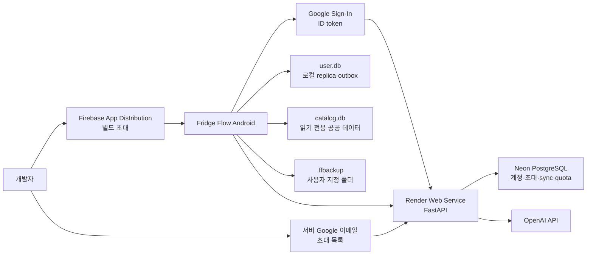
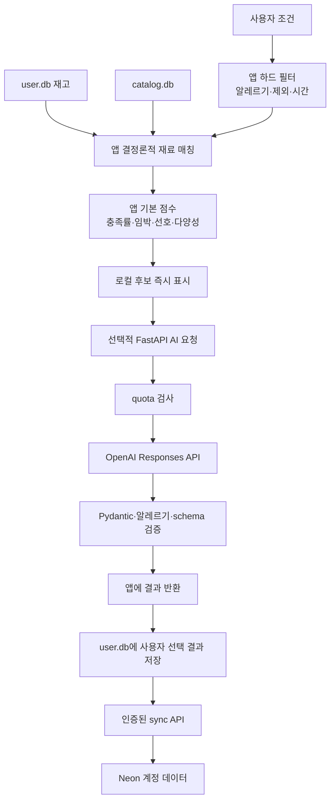

# Fridge Flow 기술 설계서

- 문서 상태: 초안 v0.5
- 작성일: 2026-07-29
- 전제: `PRODUCT_SPEC.md`의 개인·지인용 Android MVP를 구현하기 위한 현재 설계

## 1. 설계 목표

- Neon PostgreSQL을 계정별 사용자 데이터의 서버 원본으로 사용한다.
- 초대된 Google 계정만 최초 가입과 API 접근을 허용한다.
- 기기 내 SQLite replica로 로그인 후 핵심 읽기·쓰기를 네트워크 상태와 분리한다.
- outbox/cursor 동기화로 오프라인 변경이 서버 원본과 안전하게 수렴하게 한다.
- 서버 동기화와 사용자 소유 파일 백업을 함께 제공해 앱 삭제·기기 변경에 대비한다.
- AI API 키는 APK에 포함하지 않고 Render 환경변수로만 관리한다.
- FastAPI는 인증, 계정별 CRUD·동기화·복원과 AI proxy를 제공하며 사용자 데이터를 로컬 파일에 보관하지 않는다.
- 인증된 AI endpoint에도 사용자·IP·전역 요청량, 토큰, 동시성과 일·월 예산 상한을 적용한다.
- 개인 프로젝트가 무료 범위에서 유지할 수 있도록 Render Free Web Service의 휴면을 수용하고 Neon을 영속 DB로 사용한다.

## 2. 현재 시스템 경계



데이터 소유권:

- Neon PostgreSQL: Google `sub` 기반 계정, 초대 목록, 계정별 재고·위치·레시피·식단·장보기·선호·동기화·quota
- `user.db`: 해당 로그인 계정의 로컬 replica, outbox와 마지막 pull cursor
- `catalog.db`: 기본 재료, 정규화된 공공 레시피, 영양 스냅샷
- `.ffbackup`: 계정 데이터와 미전송 outbox를 포함하는 이식 가능한 버전 관리 보조 백업
- Render FastAPI: Google ID token 검증, 계정별 CRUD·동기화·복원과 AI proxy
- OpenAI: 요청 처리에 필요한 최소 정보만 전송하며 API 함수가 AI prompt 원문을 별도 보관하지 않음

Android 앱에는 Neon connection string과 OpenAI API key를 넣지 않는다. 모든 원격 데이터 접근은 인증된 FastAPI를 통한다.

## 3. 권장 기술 스택

### 3.1 Android 앱

| 영역 | 선택 | 이유 |
|---|---|---|
| 프레임워크 | Expo SDK 57 + React Native 0.86 + React 19.2.3 + TypeScript | Android 개발과 APK 배포가 간편하고 Expo 공식 호환 조합 유지 |
| 라우팅 | Expo Router | 파일 기반 라우팅과 typed route |
| 사용자 DB | expo-sqlite `user.db` | 로컬 transaction, migration, 재시작 후 유지 |
| 카탈로그 DB | 번들 SQLite `catalog.db` | 공공 레시피·영양 정보를 오프라인 조회 |
| DB 접근 | Drizzle ORM + repository 계층 | typed schema·migration·live query와 UI/SQL 분리 |
| 서버 상태 | TanStack Query | 인증·동기화·AI 요청 상태와 재시도 제어 |
| UI 상태 | Zustand + React state | Zustand는 화면 간 공유 UI 상태, React state는 컴포넌트 로컬 상태에 사용 |
| 폼/검증 | React Hook Form + Zod | 빠른 입력과 백업/응답 검증 |
| 제스처 | Gesture Handler + Reanimated | 컨테이너·재료 드래그 |
| 파일 접근 | Android Storage Access Framework | 사용자 지정 폴더에 백업 생성·파일 복원 |
| 인증 저장 | expo-secure-store | 세션 cookie/token을 일반 DB와 분리해 보관 |
| 테스트 | Jest + `jest-expo` + RNTL, Maestro | 단위·컴포넌트·E2E |
| 빌드 | EAS Build `development`·`preview` profiles | 개발 build와 서명된 지인 배포용 APK를 동일한 cloud 환경에서 생성 |

화면은 `user.db`와 `catalog.db`를 읽는다. TanStack Query cache나 HTTP 응답 객체를 사용자 데이터 원본으로 사용하지 않는다.
Drizzle `useLiveQuery`로 관련 테이블 변경 시 화면을 다시 조회하며, write는 화면이 아니라 feature repository를 통해 수행한다. Drizzle과 Drizzle Kit은 구현 시점 Expo SDK와 호환되는 정확한 버전으로 고정하고 자동 버전 범위를 사용하지 않는다.
Zustand는 냉장고 배치 편집, 선택, 필터, 식단 편집처럼 여러 컴포넌트가 공유하는 비영속 UI 상태에만 사용한다. 재고·레시피·식단 데이터와 인증 정보는 저장하지 않고 `persist` middleware도 사용하지 않는다.

- [Expo SQLite](https://docs.expo.dev/versions/latest/sdk/sqlite/)
- [Expo local-first 가이드](https://docs.expo.dev/guides/local-first/)
- [Expo Router](https://docs.expo.dev/router/introduction/)
- [Android Storage Access Framework](https://developer.android.com/training/data-storage/shared/documents-files)
- [Drizzle ORM Expo SQLite](https://orm.drizzle.team/docs/sqlite/connect-expo-sqlite)

### 3.2 FastAPI·인증·서버 DB

| 영역 | 선택 | 이유 |
|---|---|---|
| 런타임 | Python 3.13.14 / FastAPI 0.139.2 / Uvicorn | typed 비동기 API, OpenAPI와 Python 학습 목표 |
| 패키지 관리 | `pyproject.toml` + uv + `uv.lock` | 직접·전이 의존성을 고정해 로컬·CI·Render 설치 결과 일치 |
| 인증 | Google Sign-In ID token + `google-auth` | 비밀번호 운영 없이 서버에서 서명·aud/iss/exp 검증 |
| 가입 제한 | `app_invites` 이메일 allowlist | 공개 가입 없이 허용한 Google 계정만 생성 |
| 서버 DB | Neon PostgreSQL | 계정별 사용자 원본과 sync·quota transaction |
| DB 접근 | SQLAlchemy 2 async + Alembic + asyncpg | typed model, transaction과 migration |
| AI SDK | OpenAI Python SDK / Responses API | 구조화된 레시피·식단 생성 |
| 검증 | Pydantic + JSON Schema | 요청·응답 계약과 AI 출력 검증 |
| quota 저장 | Neon PostgreSQL | process 재시작과 다중 worker 사이의 원자적 예약·lease 유지 |
| 배포 | Render Free Web Service | 공식 FastAPI 지원, Git 자동 배포, 무료 휴면 |
| 테스트 | pytest + httpx | API·auth·sync·quota·AI adapter 검증 |

- [Render FastAPI 배포](https://render.com/docs/deploy-fastapi)
- [Render 무료 Web Service 제한](https://render.com/docs/free)
- [Google Android backend auth](https://developers.google.com/identity/sign-in/android/backend-auth)

다음 구성요소는 사용하지 않는다.

- 앱의 Neon 직접 연결
- 이메일/비밀번호 회원가입과 공개 가입
- Redis와 Celery
- 서버 사용자 백업과 object storage
- Better Auth와 별도 Node.js 인증 서버
- Render 무료 PostgreSQL
- Next.js 서버 및 별도 웹 프런트엔드

### 3.3 AI와 공공 데이터

| 영역 | 선택 |
|---|---|
| 생성 API | OpenAI Responses API |
| API key | Render의 `OPENAI_API_KEY` 환경변수 |
| 모델 | 초기 `gpt-5.4-mini`, 서버 환경변수로 설정하고 평가 후 변경 |
| 출력 | JSON Schema Structured Outputs + Pydantic 재검증 |
| 레시피 원본 | 식약처 조리식품 레시피 DB |
| 영양 1차 | 식약처 K-FIND |
| 영양 보조 | USDA FoodData Central |
| 사용자 저장 | 검증된 저장 결과를 Neon 원본과 Android `user.db` replica에 동기화 |

- [OpenAI Responses 및 모델 가이드](https://developers.openai.com/api/docs/guides/latest-model)
- [OpenAI Structured Outputs](https://developers.openai.com/api/docs/guides/structured-outputs)
- [식약처 조리식품 레시피 DB](https://www.data.go.kr/data/15060073/openapi.do)
- [K-FIND Open API](https://various.foodsafetykorea.go.kr/nutrient/industry/openApi/info.do)
- [USDA FoodData Central API](https://fdc.nal.usda.gov/api-guide/)

## 4. 저장소 권장 구조

```text
fridge-flow/
├─ apps/
│  └─ mobile/
│     ├─ src/app/                 # Expo Router 화면
│     ├─ src/features/            # inventory, recipes, meal-plan, shopping
│     ├─ src/db/user/             # Drizzle user.db schema, migration, repositories
│     ├─ src/db/catalog/          # Drizzle catalog.db schema, read repositories
│     ├─ src/auth/                # Google 로그인, ID token 갱신·안전한 저장
│     ├─ src/sync/                # outbox, pull cursor, conflict, retry
│     ├─ src/backup/              # export, validate, restore, retention
│     ├─ src/ai/                  # FastAPI client와 fallback
│     └─ src/shared/
├─ services/
│  └─ api/
│     ├─ app/api/                 # account, sync, restore, AI routes
│     ├─ app/auth/                # Google token verification, invite, current user
│     ├─ app/db/                  # SQLAlchemy models, repositories, transaction
│     ├─ app/sync/
│     ├─ app/ai/
│     ├─ app/quota/
│     ├─ alembic/
│     └─ tests/
├─ packages/
│  └─ api-client/                 # FastAPI OpenAPI에서 생성한 TypeScript client/type
├─ tools/
│  └─ catalog/
│     ├─ import_recipes.py
│     ├─ import_nutrition.py
│     └─ build_catalog.py
├─ assets/
│  └─ catalog.db                  # 생성 산출물 또는 release asset
├─ docs/
├─ render.yaml
└─ AGENTS.md
```

FastAPI의 OpenAPI 문서에서 `packages/api-client`의 TypeScript client/type을 생성하고 CI에서 drift를 검사한다. sync protocol과 AI schema version도 요청과 응답에 명시한다. 백업 파일과 앱 내부 입력은 계속 Zod로 검증한다.

## 5. 서버·로컬 데이터 모델

### 5.1 Neon PostgreSQL 서버 원본

| 영역/엔터티 | 핵심 필드 |
|---|---|
| AppUser | id, google_sub, email, display_name, status, created_at, last_login_at |
| AppInvite | normalized_email, status, invited_at, accepted_by |
| AppProfile | user_id, locale, timezone, preferences |
| StorageSpace | id, user_id, name, type, sort_order |
| Container | id, user_id, space_id, parent_id, name, grid geometry |
| CustomIngredient | id, user_id, canonical_name, aliases, category, default_unit |
| InventoryBatch | id, user_id, ingredient_ref, container_id, amount, unit, quantity_known, expires_on, status |
| SavedRecipe | id, user_id, catalog_recipe_id, source_type, title, snapshot |
| RecipePreference | id, user_id, recipe_ref, signal |
| MealPlan / MealSlot | id, user_id, week_start / date, meal_type, recipe_ref, servings, status |
| ShoppingList / ShoppingItem | id, user_id, required_amount, unit, checked, source |
| InventoryTransaction | id, user_id, batch_id, type, amount_delta, reason, operation_id |
| AiGeneration | id, user_id, purpose, model, schema_version, status, metrics |
| SyncOperation | idempotency_key, user_id, device_id, applied_at, result_version |
| AiQuota / AiLease | user_id 또는 global scope, bucket, reserved_tokens, expires_at |

모든 동기화 대상 행은 앱이 생성한 UUID와 `user_id`, `version`, `change_seq`, `created_at`, `updated_at`, nullable `deleted_at`을 갖는다. 서버는 검증된 Google `sub`에 매핑된 AppUser에서 `user_id`를 결정하며 request body의 사용자 식별자를 권한 근거로 사용하지 않는다. 일반 사용자 데이터 query에는 항상 같은 `user_id` 범위를 강제하고, 자동화된 두 계정 격리 테스트를 둔다.

삭제 tombstone은 마지막 수정 후 90일간 보존한 뒤 정리할 수 있다. `InventoryTransaction`은 hard delete하지 않으며 `(user_id, operation_id, id)` 또는 도메인에 맞는 unique constraint로 중복 차감을 막는다.

실사용 전 모든 사용자 table에 `user_id` 기반 PostgreSQL RLS를 활성화한다. runtime query는 `BYPASSRLS`가 없는 전용 role과 인증 dependency가 설정한 user context를 사용하며 migration용 owner connection과 분리한다.

### 5.2 로컬 `user.db`

로컬에는 화면과 오프라인 계산에 필요한 위 사용자 도메인 테이블을 같은 UUID로 복제한다. 서버 전용 account, invite와 quota table은 복제하지 않는다. 각 동기화 행에는 다음 metadata를 둔다.

- `server_version`: 마지막으로 확인한 서버 version
- `sync_status`: `synced`, `pending`, `conflict`
- `deleted_at`: 아직 모든 기기에 전달되지 않은 삭제 표시

로컬 전용 table:

| 엔터티 | 핵심 필드 |
|---|---|
| LocalAccount | user_id, last_full_sync_at |
| SyncState | pull_cursor, last_success_at, last_error |
| SyncOutbox | operation_id, entity_type, entity_id, action, base_version, payload, created_at, attempt_count |
| SyncConflict | entity_type, entity_id, local_snapshot, server_snapshot, detected_at, resolution |

한 기기에는 현재 로그인한 한 계정의 `user.db` replica만 유지한다. 다른 계정으로 전환하려면 먼저 로그아웃 절차로 기존 계정 DB를 제거한 뒤 새 replica를 bootstrap한다. Google ID token은 `user.db`에 넣지 않고 Google 인증 client와 Android의 안전한 저장소로 관리한다.

### 5.3 `catalog.db`

| 엔터티 | 핵심 필드 |
|---|---|
| CatalogMetadata | schema_version, source_versions, built_at |
| Ingredient | id, canonical_name, aliases, category, default_unit |
| Recipe | id, source, source_recipe_id, title, servings, parse_status |
| RecipeIngredient | recipe_id, ingredient_id, amount, unit, optional |
| RecipeStep | recipe_id, step_order, instruction, minutes |
| NutritionFood | id, source, source_food_id, source_version, basis_amount, basis_unit |
| NutrientValue | nutrition_food_id, nutrient_code, amount, unit |

`catalog.db`는 읽기 전용이다. 앱 업데이트 시 교체할 수 있지만 `user.db`는 보존한다. 저장된 레시피가 카탈로그 레시피를 참조할 때는 표시와 복원을 위해 필요한 snapshot도 `SavedRecipe`에 함께 저장한다.

### 5.4 수량과 유통기한

- 수량은 `Decimal amount`와 `unit`으로 저장한다.
- UI 기본 단위는 g, kg, ml, L, 개, 팩, 봉, 병, 캔이다.
- 포장 단위는 `package_count`와 선택적인 `package_size`/`package_size_unit`을 함께 저장한다.
- `quantity_known=false`이면 `amount`를 임의의 0으로 대체하지 않는다.
- 질량↔부피는 재료별 밀도 근거가 있을 때만 변환한다.
- `expires_on`은 nullable date이며 UI에서는 `유통기한`으로 표시한다.
- FEFO는 날짜가 있는 묶음을 오름차순으로 사용하고 날짜가 없는 묶음을 마지막에 사용한다.

## 6. 인증과 동기화

### 6.1 초대·Google 로그인·요청 인증

1. 운영자가 정규화한 Google 이메일을 `AppInvite`에 등록한다.
2. 앱은 Android Google Sign-In으로 server web client ID를 audience로 하는 ID token을 얻는다.
3. 앱은 HTTPS `Authorization: Bearer <id-token>`으로 FastAPI를 호출한다.
4. FastAPI는 `google-auth`로 서명, `aud`, `iss`, `exp`, `email_verified`를 검증하고 `sub`를 안정적인 외부 식별자로 사용한다.
5. 첫 요청에서는 정규화된 verified email과 사용 가능한 초대를 확인한 뒤 AppUser와 AppProfile을 만들고 초대를 사용 처리한다.
6. 이후 모든 요청에서 token의 `sub`를 AppUser에 매핑하고 `status=active`를 확인한다.
7. 앱은 Google 로그인 상태를 복원하고 만료된 ID token을 갱신한다. 갱신이나 검증에 실패하면 다시 로그인을 요청한다.
8. 첫 로그인·재설치·로컬 DB 불일치 시 인증된 계정의 전체 snapshot을 내려받는다.

`/health`를 제외한 사용자·동기화·AI endpoint는 유효한 Google ID token이 필요하다. 로그아웃 전 outbox가 비어 있지 않으면 먼저 동기화를 시도하고, 실패하면 로그아웃 취소 또는 미전송 변경 폐기 경고를 제공한다. 정상 로그아웃은 Google 로그인 상태와 token, 해당 계정의 `user.db`를 제거한다. `catalog.db`와 공개 레시피 이미지 cache는 유지한다. FastAPI는 ID token 원문을 DB나 log에 저장하지 않는다.

MVP 초대 관리는 별도 관리자 화면을 만들지 않고 검증된 운영 script 또는 Neon console에서 수행한다. 초대 이메일은 trim·lowercase로 정규화하고 unique constraint를 둔다.

`AppInvite`는 최초 가입 gate이며 사용·취소·삭제가 기존 AppUser 상태를 변경하지 않는다. 기존 사용자를 차단할 때는 `AppUser.status=suspended`로 바꾸며 FastAPI는 `/health`를 제외한 모든 요청에서 이를 검사해 `403 ACCOUNT_SUSPENDED`를 반환한다. 정지는 사용자 데이터를 삭제하지 않고, `active`로 복구하면 기존 데이터와 동기화를 다시 사용할 수 있게 한다.

### 6.2 로컬 쓰기와 push

1. UI가 UUID `operation_id`와 함께 도메인 command를 repository에 전달한다.
2. repository가 하나의 SQLite transaction에서 로컬 레코드·활동 기록과 `SyncOutbox`를 함께 변경한다.
3. Drizzle observer가 화면을 즉시 갱신한다.
4. 온라인이면 sync worker가 operation을 생성 순서대로 `/v1/sync/push`에 전송한다.
5. 서버는 인증된 AppUser, idempotency key, schema와 `base_version`을 검증하고 Neon transaction으로 적용한다.
6. 성공 응답의 server version/change cursor를 로컬에 반영하고 outbox 항목을 제거한다.
7. timeout이나 재시도에도 같은 operation ID를 사용해 서버 변경이 한 번만 적용되게 한다.

### 6.3 pull과 실행 시점

- 앱 시작, foreground 복귀, 로컬 mutation 직후, 수동 새로고침 때 sync를 시도한다.
- `/v1/sync/pull?cursor=...`는 해당 계정의 cursor 이후 변경을 안정된 순서로 최대 500개씩 반환한다.
- 한 page를 SQLite transaction으로 적용한 뒤에만 로컬 cursor를 전진시킨다.
- 네트워크 실패 시 기존 화면과 outbox를 유지하고 지수 backoff로 재시도한다.
- 마지막 성공 시각과 대기/충돌 건수를 홈과 설정에 표시한다.

### 6.4 충돌 규칙

- 서버 version이 `base_version`과 다르면 `409 SYNC_CONFLICT`와 서버 snapshot을 반환한다.
- 단순 표시 순서, 체크 상태처럼 손실 위험이 낮은 필드는 서버 수신 순서 기준으로 자동 해결할 수 있다.
- 이름, 수량, 날짜, 식단 배치처럼 의미가 달라질 수 있는 충돌은 양쪽 값을 보존하고 사용자에게 선택을 요청한다.
- 재고 차감·undo·adjustment는 최종 수량 덮어쓰기 대신 append-only `InventoryTransaction`으로 병합한다.
- 삭제와 수정이 충돌하면 삭제를 자동 확정하지 않고 복구 또는 삭제를 선택하게 한다.
- 서버 시각을 정렬과 version의 기준으로 사용하고 기기 시계만으로 충돌 승자를 정하지 않는다.

재고 차감:

- 실제 수량은 최종 값 덮어쓰기보다 `InventoryTransaction` delta 합으로 추적한다.
- 한 조리의 모든 차감은 같은 `operation_id`를 사용한다.
- undo는 반대 delta transaction을 추가하며 과거 기록을 삭제하지 않는다.
- 앱은 조리 직후 10초, 활동 기록에서는 7일까지 undo를 허용한다.
- 7일 이후 오류는 새 `adjustment` transaction으로 정정한다.
- 차감·undo·adjustment 기록은 사용자가 직접 전체 데이터를 초기화하기 전까지 보존한다.

## 7. 백업과 복원

### 7.1 저장 위치

Android Storage Access Framework의 directory picker로 사용자가 폴더를 선택한다. 앱은 persistable URI permission을 저장하고 선택한 폴더 안에서만 백업 파일을 생성·정리한다.

백업 폴더는 앱 전용 저장소 밖에 있으므로 앱 삭제 후에도 남을 수 있다. 권한이 취소되거나 폴더가 이동되면 다시 선택하도록 안내한다.

### 7.2 파일 형식

확장자: `.ffbackup`

```text
fridge-flow-20260729-153000.ffbackup
├─ manifest.json
└─ data.json
```

`manifest.json` 필수 필드:

```json
{
  "format": "fridge-flow-backup",
  "format_version": 1,
  "schema_version": 1,
  "app_version": "0.1.0",
  "account_id": "opaque-user-uuid",
  "server_cursor": "opaque-cursor",
  "created_at": "2026-07-29T06:30:00Z",
  "record_counts": {},
  "data_sha256": "hex-string"
}
```

백업에는 다음을 포함한다.

- 사용자 프로필과 설정
- 공간·컨테이너·재고·거래 기록
- 저장한 레시피와 AI 생성 레시피 snapshot
- 식단·장보기·추천 피드백
- 아직 서버에 반영되지 않은 outbox operation
- 자동 백업 설정

다음은 제외한다.

- `catalog.db`
- OpenAI API key와 서버 설정
- Google ID/access token과 인증 저장소 내용
- AI 요청 원문과 디버그 로그
- 임시 cache
- Android 폴더 URI와 기기 전용 경로

### 7.3 생성 정책

- 사용자가 `백업하기`를 누르면 즉시 timestamp 파일을 만든다.
- 앱을 실행한 날 백업이 없다면 첫 성공한 로컬 변경 또는 동기화 뒤 일 1회 자동 백업한다.
- 백그라운드 실행만 믿지 않고 foreground lifecycle에서 완료를 보장한다.
- 자동 백업은 최근 7개 일간 파일과 4개 주간 파일을 유지한다.
- 수동 백업은 사용자가 직접 삭제하기 전까지 자동 정리하지 않는다.
- 파일 쓰기는 임시 이름으로 완료한 뒤 최종 이름으로 확정해 부분 파일을 줄인다.

### 7.4 복원 정책

1. 시스템 file picker에서 `.ffbackup`을 선택한다.
2. archive 구조, format version, schema version, size limit과 SHA-256을 검사한다.
3. 현재 로그인 계정과 백업의 계정 식별자가 호환되는지 확인한다.
4. 레코드 수, 백업 시각, 서버 데이터를 전체 교체한다는 경고를 보여준다.
5. 최신 서버 데이터를 내려받아 `pre-restore` 안전 백업으로 저장한다.
6. 임시 SQLite DB에 파일을 import하고 FK·수량·단위·outbox 제약을 검사한다.
7. 검증된 snapshot을 idempotency key와 함께 `/v1/account/restore`에 전송한다.
8. 서버는 계정 단위 restore lock을 얻고 하나의 Neon transaction에서 현재 계정 데이터만 전체 교체한다.
9. 성공하면 새 server cursor와 snapshot으로 로컬 DB를 교체한다.
10. 실패하면 임시 DB를 폐기하고 기존 서버·로컬 데이터를 유지한다.

MVP 복원은 로그인한 현재 계정의 `전체 교체`만 지원한다. 다른 계정으로의 복원과 병합 복원은 허용하지 않는다.

현재 앱보다 높은 schema version의 백업은 거부하고 업데이트 필요 메시지를 표시한다. 낮은 버전은 순차 migration 후 복원한다.

### 7.5 보안 한계

`.ffbackup`은 암호화하지 않고 checksum으로 무결성만 확인한다. 백업에는 알레르기·식단 선호가 포함될 수 있으므로 신뢰할 수 있는 개인 폴더에 보관하도록 안내한다. 설정 화면과 백업 완료 화면에 파일을 다른 사람과 공유하지 말라는 안내를 표시한다.

## 8. 공공 카탈로그 빌드

### 8.1 레시피

- 식약처 `COOKRCP01` 데이터를 개발 도구로 내려받는다.
- 원본 ID, 출처, 마지막 import 시각을 저장한다.
- 재료 문자열을 Ingredient, Decimal 수량, 단위로 정규화한다.
- parse 상태를 `verified`, `partial`, `failed`로 분류한다.
- `verified`만 수량 기반 추천 후보로 사용한다.
- `partial`은 일반 검색에만 표시하고 충족 여부를 확정하지 않는다.
- API가 제공하는 이미지 URL만 사용하고 외부 상업 사이트 이미지를 수집하지 않는다.

이미지 정책:

- `catalog.db`에는 공공 API의 thumbnail/detail URL과 출처만 저장하고 image binary는 넣지 않는다.
- 화면 최초 노출 시 thumbnail을 앱 cache directory로 내려받고 이후 cache hit를 사용한다.
- detail 원본 이미지는 사용자가 레시피 상세를 열 때만 요청한다.
- cache 최대 크기는 150MB이며 least recently used 파일부터 삭제한다.
- HTTP 실패, offline cache miss, 잘못된 content type에는 정적 placeholder를 표시한다.
- cache 파일은 `.ffbackup`에서 제외하고 사용자가 설정에서 전체 삭제할 수 있게 한다.
- AI 생성·사용자 작성 레시피는 초기 버전에서 placeholder를 사용한다.

### 8.2 영양

- K-FIND 원본을 정규화하고 앱에서 사용하는 공통 재료·공공 레시피 범위만 추출한다.
- USDA 보완 데이터도 같은 schema로 변환한다.
- 출처별 100g/100ml/1회 제공량을 보존한다.
- source id, 기준량과 source version을 함께 저장한다.
- AI가 영양 값을 직접 생성하지 않는다.
- 매칭되지 않은 재료는 `정보 없음` 또는 추정 표시를 하고 다음 catalog build 후보로 기록한다.

### 8.3 갱신

- 3개월마다 원본 버전을 확인한다.
- import script와 fixture로 동일 입력이 동일 `catalog.db`를 만들도록 한다.
- schema·출처·레코드 수·중복·참조 무결성 검사를 통과한 파일만 앱 asset으로 승격한다.
- catalog 갱신은 APK 업데이트로 전달한다.

## 9. 추천 및 AI 파이프라인



AI 요청에는 필요한 최소 정보만 포함한다.

- 구조화된 사용자 조건
- 선택된 후보 또는 필요한 재료 subset
- 허용·제외 재료
- 출력 schema version
- 사용자 이름, 이메일, Google ID token, 기기 파일과 전체 DB는 OpenAI에 전송하지 않음

Render FastAPI와 OpenAI가 실패하거나 한도에 도달해도 앱은 `catalog.db` 기반 추천을 계속 제공한다.

### 9.1 AI 출력 계약

```json
{
  "title": "string",
  "servings": 2,
  "ingredients": [
    {
      "ingredient_id": "catalog-id-or-null",
      "name": "string",
      "amount": 100,
      "unit": "g",
      "optional": false
    }
  ],
  "steps": [
    {
      "order": 1,
      "instruction": "string",
      "minutes": 5
    }
  ],
  "recommendation_reason": "string",
  "warnings": []
}
```

FastAPI는 Pydantic과 하드 제외 조건으로 다시 검증한다. 실패 시 한 번의 제한된 수정을 시도하고, 그래도 실패하면 `502 AI_OUTPUT_INVALID`를 반환한다.

## 10. FastAPI endpoint와 비용 방어

### 10.1 API 초안

| Method | Path | 목적 |
|---|---|---|
| GET | `/health` | 서버 상태 |
| GET | `/v1/account/me` | Google ID token 검증, 초대 기반 최초 계정 생성과 상태 |
| GET | `/v1/account/bootstrap` | 첫 로그인·재설치용 계정 snapshot |
| DELETE | `/v1/account` | 재인증·확인 후 현재 계정과 모든 사용자 데이터 삭제 |
| POST | `/v1/sync/push` | idempotent 로컬 mutation 적용 |
| GET | `/v1/sync/pull` | cursor 이후 계정 변경분 조회 |
| POST | `/v1/account/restore` | 검증된 백업으로 현재 계정 전체 교체 |
| GET | `/v1/ai/quota` | 남은 기능별 한도 요약 |
| POST | `/v1/ai/recommendations` | 후보 개인화와 설명 |
| POST | `/v1/ai/recipes` | 새 레시피 초안 |
| POST | `/v1/ai/meal-plans` | 식단 초안 |

재고, 식단, 장보기와 저장 레시피 변경은 MVP에서 공통 sync mutation 계약으로 전달한다. 각 endpoint는 Google ID token을 검증하고 매핑된 AppUser의 `user_id`만 사용한다.

`DELETE /v1/account`는 최신 Google 재인증 증거와 명시적 확인 값을 요구한다. 선택적 백업 안내 뒤 하나의 Neon transaction에서 해당 user scope의 도메인 데이터, sync operation, quota의 개인 연결과 AppUser를 삭제한다. 익명화된 전역 비용 집계만 남길 수 있다. 성공 응답 후 앱은 로컬 DB와 Google 로그인 상태를 제거한다. AppInvite는 다시 사용 가능하게 되지 않으며 재가입에는 새 초대가 필요하다.

### 10.2 환경변수

```env
OPENAI_API_KEY=...
OPENAI_MODEL=gpt-5.4-mini
DATABASE_URL=...
GOOGLE_SERVER_CLIENT_ID=...
DATABASE_POOL_SIZE=5
AI_MAX_REQUEST_BODY_BYTES=65536
AI_MAX_INPUT_TOKENS=8000
AI_MAX_OUTPUT_TOKENS=2000
AI_MAX_CONCURRENT_REQUESTS=2
AI_PER_USER_REQUESTS_PER_MINUTE=5
AI_PER_USER_REQUESTS_PER_DAY=20
AI_PER_IP_REQUESTS_PER_MINUTE=5
AI_PER_IP_REQUESTS_PER_DAY=20
AI_GLOBAL_REQUESTS_PER_DAY=50
AI_GLOBAL_TOKENS_PER_MONTH=1000000
AI_QUOTA_TIMEZONE=Asia/Seoul
AI_KILL_SWITCH=false
IP_HASH_SECRET=...
```

`DATABASE_URL`은 RLS를 우회하지 않는 pooled runtime role을 사용한다. migration owner connection은 별도 CI secret으로만 제공하고 FastAPI runtime에는 노출하지 않는다. Neon connection string과 OpenAI key는 Render 환경변수에만 두고 저장소·APK·백업에 넣지 않는다. `GOOGLE_SERVER_CLIENT_ID`는 secret은 아니지만 허용 audience를 고정하는 설정이므로 환경별로 명시한다. 위 quota 값을 초기 운영값으로 사용하고 실제 사용량과 비용을 확인한 뒤 조정한다. 필수 환경변수가 없으면 API는 안전하게 시작을 거부한다.

### 10.3 quota 처리

1. Render proxy 설정과 FastAPI middleware가 body size와 timeout을 제한한다.
2. Pydantic이 endpoint·schema·문자열 길이와 배열 개수를 검증한다.
3. Google ID token에서 매핑한 `user_id`를 확인하고 신뢰할 수 있는 proxy 요청 정보에서 얻은 IP를 HMAC 처리한 뒤 원문을 버린다.
4. 하나의 Neon transaction에서 사용자별·IP별 분·일 요청 수, 전역 일 요청 수, 월 token 예산을 검사한다.
5. 같은 transaction에서 요청의 최대 input+output token을 예약하고 만료 시간이 있는 동시 실행 lease를 획득한다.
6. 예약과 lease 획득에 성공한 요청만 `store=false`로 OpenAI에 보낸다.
7. 응답의 실제 usage로 예약량을 정산하고 lease를 해제한다. 중단된 request나 process의 lease는 만료 시간으로 자동 무효화한다.
8. 실패 요청도 정책에 정한 최소 비용으로 기록하며, 어떤 한도라도 넘으면 OpenAI를 호출하지 않고 `429 AI_QUOTA_EXCEEDED`를 반환한다.

FastAPI process memory나 Render 임시 파일은 재시작·worker 간 공유를 보장하지 않으므로 한도의 원본으로 사용하지 않는다. IP 원문은 저장하지 않으며 IP hash 집계는 짧은 보존 기간 뒤 삭제한다. 계정별 집계는 비용 감사에 필요한 기간만 보존한다. `AI_KILL_SWITCH=true`이면 모든 생성 endpoint를 즉시 차단한다.

### 10.4 한도 응답과 앱 표시

한도 도달 응답은 HTTP `429`와 기계 판독 가능한 범위를 반환한다.

```json
{
  "error": {
    "code": "AI_QUOTA_EXCEEDED",
    "scope": "global_daily",
    "message": "오늘의 AI 사용 한도에 도달했어요.",
    "reset_at": "2026-07-30T00:00:00Z",
    "local_fallback_available": true,
    "request_id": "uuid"
  }
}
```

`scope`은 `user_minute`, `user_daily`, `ip_minute`, `ip_daily`, `global_daily`, `global_monthly_tokens` 중 하나다. 일간 한도는 `Asia/Seoul` 자정, 월간 한도는 매월 1일 `Asia/Seoul` 자정에 초기화한다. `reset_at`은 UTC ISO 8601로 전달하고 앱이 현지 시각으로 표시한다. 서버는 가능한 경우 `Retry-After` header도 제공한다.

앱 처리:

- 현재 요청 화면에서 snackbar 또는 inline message로 즉시 알린다.
- 일·월 한도는 홈과 요리 화면에 reset 시각이 포함된 지속 배너로 표시한다.
- 제한이 풀릴 때까지 AI 생성 버튼을 비활성화한다.
- 로컬 카탈로그 추천, 저장 레시피, 재고·식단 기능은 계속 사용할 수 있게 한다.
- `503 AI_DISABLED`와 `AI_PROVIDER_UNAVAILABLE`은 사용량 초과와 다른 문구로 표시한다.

### 10.5 보안 한계

- 모든 사용자·동기화·AI endpoint는 검증된 Google ID token이 필요하며 초대된 이메일의 active 계정만 사용할 수 있다.
- 각 데이터 query는 인증된 AppUser의 `user_id`를 강제하고 non-owner DB role과 PostgreSQL RLS를 방어 계층으로 사용한다.
- APK에 shared secret을 넣어도 추출 가능하므로 보안 경계로 취급하지 않는다.
- Firebase App Distribution은 공식 빌드 전달 대상을 제한하지만 APK 재공유를 완전히 방지하지 않는다.
- 재공유된 APK도 초대되지 않은 Google 계정으로는 사용자 API를 사용할 수 없다.
- 탈취된 ID token이나 허용 계정의 오남용 가능성은 남으므로 계정 정지, token 만료, 사용자·IP·전역 quota와 kill switch를 유지한다.
- 요구 수준이 높아지면 Android app attestation과 관리자용 기기 철회를 추가한다.

## 11. 배포

### 11.1 Android

- EAS Build의 `development` profile로 개발 build를 만들고 `preview` profile의 `android.buildType: "apk"`로 서명된 배포용 APK를 만든다.
- Firebase App Distribution의 테스터 이메일 명단에 본인과 지인만 등록한다.
- 새 build도 같은 초대 그룹에 전달한다.
- 앱 시작에는 `Google로 계속하기` 화면이 있으며 Google 로그인 상태를 복원하고 ID token을 필요할 때 갱신한다.
- Firebase 배포 명단과 서버 `AppInvite` 목록을 별도로 관리한다. 실제 데이터 접근 경계는 서버 인증·인가다.

- [Firebase App Distribution 테스터 안내](https://firebase.google.com/docs/app-distribution/get-set-up-as-a-tester?platform=android)

### 11.2 Render FastAPI

- `services/api`를 Render Free Web Service에 Python runtime으로 배포한다.
- Render service region은 `singapore`, Neon project region은 AWS `ap-southeast-1` Singapore로 맞춘다.
- build command는 잠긴 의존성을 설치하고, start command는 `uvicorn app.main:app --host 0.0.0.0 --port $PORT`를 사용한다.
- Git 기본 branch를 연결하고 CI 성공 후 자동 배포하도록 설정한다.
- HTTPS endpoint만 사용하고 `/health`를 Render health check로 설정한다.
- `OPENAI_API_KEY`, Neon runtime connection과 quota 설정은 Render 환경변수에만 둔다.
- Neon PostgreSQL에는 account, 초대, 계정별 사용자 데이터, sync operation, quota와 concurrency lease를 schema로 분리해 저장한다.
- application log에 ID token, 요청 본문, 재료 목록, 알레르기, AI 전체 출력과 API key를 남기지 않는다.
- 무료 서비스는 15분간 inbound traffic이 없으면 휴면하고 다음 요청의 시작에 약 1분이 걸릴 수 있음을 정상 운영 조건으로 수용한다.
- Render 인스턴스의 파일시스템은 임시이므로 upload, SQLite와 quota 파일을 저장하지 않는다.
- Render 무료 PostgreSQL은 30일 후 만료되므로 사용하지 않고 Neon을 유지한다.
- Render 무료 한도와 OpenAI API 요금은 별개이므로 OpenAI 쪽 예산 제한도 함께 설정한다.

앱은 Neon에 직접 연결하지 않는다. Redis, object storage와 Kubernetes는 필요하지 않다.

휴면 해제 UX:

- 기존 로그인 사용자는 서버 응답을 기다리지 않고 `user.db`의 홈·재고·식단을 먼저 본다.
- 원격 요청이 즉시 응답하지 않으면 `서버를 시작하고 있어요` 상태와 로컬 사용 가능 안내를 표시한다.
- bootstrap·sync 요청은 최대 90초 안에서 한 번만 자동 재시도하고 mutation은 같은 idempotency key를 유지한다.
- 첫 설치처럼 로컬 데이터가 없을 때만 로그인 뒤 서버 준비 화면을 blocking 상태로 표시한다.
- 인위적인 keep-alive ping으로 무료 휴면을 우회하지 않는다.

### 11.3 CI/CD

Pull Request:

1. format/lint
2. 앱 TypeScript typecheck와 FastAPI Python static check
3. 앱 단위 테스트와 FastAPI pytest
4. FastAPI OpenAPI에서 생성한 TypeScript client drift 검사
5. `user.db` migration test
6. Alembic migration·계정 격리·sync protocol test
7. `catalog.db` schema·출처·참조 무결성 검사
8. 백업 구버전 fixture restore 검사
9. secret·dependency scan

배포:

1. Neon preview branch에서 migration 적용
2. FastAPI에서 Google token mock, 계정 격리, sync와 AI quota 통합 테스트
3. production 환경변수·Google audience·HTTPS·kill switch 확인
4. GitHub Actions가 Neon production expand migration을 적용
5. CI 성공 뒤 Render가 연결 branch를 자동 배포
6. 초대된 시험 계정의 로그인→mutation→재동기화와 AI quota 정산 검증
7. Android release build와 migration/backup E2E
8. Firebase App Distribution 초대 그룹과 서버 AppInvite 등록

## 12. 관찰 가능성과 운영 목표

서버 집계:

- 로그인 성공·초대 거부·Google token 검증 오류 수
- sync push/pull 성공률, outbox 대기 시간과 conflict 수
- 계정별 데이터 API 오류 수(로그에는 opaque user id만 허용)
- endpoint별 성공·429·4xx·5xx 수
- OpenAI 호출 성공률과 p95 latency
- schema validation 실패율
- 일·월 요청 및 token 사용량
- quota 차단 횟수와 최대 동시 실행 수
- 앱 버전별 요청 수(개인 식별 없는 header)

저장하지 않는 항목:

- 사용자 재고·식단·알레르기 원문
- 전체 AI prompt와 output
- 원본 IP
- 이메일, Google profile 원문과 기기 광고 ID

오류 추적:

- FastAPI 오류는 Sentry Python SDK로 수집하며 `SENTRY_DSN`이 없으면 오류 추적만 비활성화하고 API는 정상 실행한다.
- `send_default_pii=false`, `include_local_variables=false`, `traces_sample_rate=0`을 초기값으로 사용해 PII와 실행 중 지역 변수 및 성능 trace를 보내지 않는다.
- `before_send`에서 request body, query string, cookie, `Authorization` header, breadcrumb data와 사용자 객체를 제거한다.
- Pydantic validation 오류의 입력값, AI prompt·output, 재고·식단·알레르기, 이메일과 원본 IP를 event나 exception message에 포함하지 않는다.
- endpoint 이름, HTTP status, 안전한 domain error code, release와 environment만 tag로 전송한다.
- Android 앱 오류 추적은 MVP에서 외부 수집하지 않는다. 재현이 어려운 문제가 실제로 발생하면 동일한 비수집 원칙으로 별도 도입한다.

- [Sentry Python SDK 설정](https://docs.sentry.io/platforms/python/configuration/options/)
- [Sentry 데이터 스크러빙](https://docs.sentry.io/security-legal-pii/scrubbing/)

초기 목표:

- warm 상태 일반 AI API p95 15초 이하
- Render 휴면 해제 요청은 90초 안에 상태 안내와 성공 또는 재시도 경로 제공
- quota 초과 OpenAI 호출 0건
- kill switch 동작 1분 이내
- online mutation의 95%가 10초 안에 서버 반영
- 계정 간 데이터 노출 0건
- release 후보의 핵심 Maestro E2E 실행 중 앱 crash 0건
- 정상 백업 fixture 복원 성공률 100%

### 12.1 MVP 이후 기기 알림

- Expo SDK 57 호환 `expo-notifications`를 사용해 Android 기기 안에서 알림을 예약한다.
- 앱 시작이 아니라 사용자가 알림 기능을 켤 때 Android 알림 권한을 요청한다.
- 기본 알림은 사용자가 정한 시간의 유통기한 임박 재료 일 1회 요약이며 식단 알림은 별도로 켤 수 있다.
- 재료·유통기한·식단이 변경되거나 서버 동기화가 끝나면 기존 예약을 취소하고 로컬 DB 기준으로 다시 예약한다.
- 알림 본문에는 사용자가 잠금 화면 노출을 원하지 않을 수 있으므로 기본적으로 재료명을 나열하지 않고 건수만 표시한다.
- 서버 push token, FCM 발송 API와 상시 scheduler는 도입하지 않는다. 앱을 장기간 열지 않아 로컬 일정이 갱신되지 않는 한계를 허용한다.

- [Expo Notifications](https://docs.expo.dev/versions/v57.0.0/sdk/notifications/)

## 13. 테스트 전략

### 13.1 로컬 도메인

- 단위 변환과 비호환 단위
- FEFO와 유통기한 null
- 인분 배율과 영양 합계
- 식단 필요량, 재고 가상 할당, 장보기 병합
- 차감, 7일 undo, adjustment
- 추천 점수와 반복 패널티

### 13.2 백업

- 동일 데이터 export→restore round trip
- 최근 7개 일간/4개 주간 자동 보존
- 수동 백업이 자동 정리되지 않음
- 잘못된 확장자, archive traversal, size 초과, checksum 오류 거부
- 상위 schema version 거부와 하위 version migration
- 복원 직전 안전 백업
- import 중 오류 발생 시 기존 `user.db` 보존
- 앱 삭제 후 사용자 지정 폴더의 파일로 새 설치 복원

### 13.3 인증·동기화·계정 격리

- 초대된 verified Google 이메일의 최초 가입과 로그인 상태 복원
- 초대되지 않은 이메일, 사용 완료·취소 초대 거부
- 위조·만료 token, 잘못된 audience/issuer와 미검증 이메일 거부
- 두 계정의 모든 read/write/restore 교차 접근 거부
- offline mutation→앱 종료→재연결 후 outbox 적용
- 같은 operation 재시도 시 한 번만 적용
- 여러 page pull 중 실패해도 cursor가 앞서가지 않음
- `base_version` conflict와 삭제/수정 conflict 보존
- append-only 차감·undo의 다중 기기 병합
- tombstone 보존과 새 기기의 삭제 반영
- 재설치 후 bootstrap으로 동일 계정 복구

### 13.4 FastAPI·Render와 quota

- API key가 응답·로그·exception에 노출되지 않음
- body·문자열·배열·token 상한
- 분당, IP별 일일, 전역 일일, 월 token 한도
- FastAPI 재배포·process 재시작·Render 휴면 후 quota 유지
- 여러 worker에서 원자적 한도 예약
- 동시 실행 lease와 비정상 종료 후 lease 만료
- kill switch
- OpenAI timeout, 429, malformed output
- request body가 application log에 기록되지 않음

### 13.5 E2E

- 설치 후 초대 Google 로그인과 세션 재사용
- 초대되지 않은 계정의 접근 거부
- 60초 이내 첫 재료 등록
- 컨테이너 드래그와 undo
- 완전 오프라인 재고·식단·장보기
- 규칙 추천 → 선택적 AI → 저장
- 백업 폴더 지정 → 백업 → 앱 데이터 초기화 → 복원
- 오프라인 변경 → 재연결 → 다른 설치에서 pull
- AI 한도 도달 후 로컬 추천 fallback

### 13.6 AI 평가

- 일반 냉장고, 거의 빈 냉장고, 유통기한 임박 다수
- 다양한 단위와 수량 부족
- 다이어트/고단백/시간 제한
- 알레르기와 충돌하는 요청
- 최근 7일 반복 메뉴
- 한국 식재료와 동의어

평가 지표는 schema 통과율, 하드 조건 위반 0건, 재료 충족 정확도, 다양성, 사람 평가 관련성, 요청당 token과 latency다.

## 14. 위험과 완화

| 리스크 | 완화 |
|---|---|
| 기기 분실·삭제 | 서버 bootstrap 복구, 미전송 outbox 경고, 보조 파일 백업 |
| 백업 파일 손상 | manifest, checksum, 임시 파일, pre-restore 백업, rollback |
| 백업 파일 노출 | 개인 폴더 안내, 민감 로그 제외, 향후 암호화 검토 |
| 계정 간 데이터 노출 | token의 AppUser scope 강제, non-owner DB role/RLS, 자동 격리 테스트 |
| Google ID token 탈취·위조 | HTTPS, 안전한 인증 저장소, 서명·aud/iss/exp 검증과 계정 정지 |
| 동기화 중복·충돌 | idempotency key, server version, append-only 거래와 conflict UI |
| Neon Free 한도·휴면 | 사용량 모니터링, 작은 payload/cursor pagination, 로컬 replica와 백업 유지 |
| 카탈로그 용량 증가 | 공통 재료·검증 레시피 subset만 포함, index와 압축 |
| catalog와 user schema 불일치 | 독립 schema version과 호환성 테스트 |
| AI endpoint 악용 | 요청·token·동시성·일·월 한도, kill switch |
| 허용 계정의 quota 선점 | 사용자·IP별 한도와 계정 정지; 필요 시 app attestation 도입 |
| AI 환각 | 후보 제한, structured output, Pydantic, 하드 조건 재검사 |
| 외부 AI 장애 | 로컬 카탈로그 추천 유지 |
| Render 휴면과 약 1분 cold start | 로컬 데이터 우선 표시, 서버 시작 안내, 90초 timeout과 안전한 재시도 |
| Render 무료 사용량 소진·정지 | 사용량 모니터링, 로컬 기능 유지, 필요 시 paid instance 전환 |
| APK 재공유 | 서버 초대 Google 계정만 로그인 허용; 필요 시 app attestation 추가 |

## 15. 구현 순서

1. Expo Android, Render FastAPI와 Neon 최소 골격
2. Google ID token 검증, AppUser/AppInvite와 인증 상태 복원
3. Neon SQLAlchemy/Alembic과 `user.db` Drizzle schema·repository
4. bootstrap, outbox/push/pull cursor와 계정 격리
5. 재고·공간·컨테이너·유통기한
6. 공공 데이터 import script와 `catalog.db`
7. 규칙 기반 추천과 영양 계산
8. 조리 차감 transaction/undo와 idempotent sync
9. 식단과 장보기
10. `.ffbackup` export, 보존, validation과 계정 restore
11. FastAPI OpenAI adapter와 structured output
12. Neon quota transaction, 모든 비용 상한과 kill switch
13. AI fallback과 사용자 메시지
14. Firebase App Distribution, AppInvite와 재설치 복구 훈련

## 16. 기술 미결정 사항

현재 기획 단계의 미결정 사항은 없다. 구현 중 사용자 경험·비용·개인정보·데이터 보존·운영 범위를 바꾸는 새 결정이 생기면 이 절에 추가하고 사용자에게 확인한다. 그 외 구현 세부사항은 호환성 검증과 테스트 결과를 근거로 결정 기록에 남긴다.

## 17. 기술 결정 기록

| 날짜 | 결정 | 상태 | 근거 |
|---|---|---|---|
| 2026-07-29 | FastAPI 백엔드 | 재채택 | Render 무료 휴면을 수용하고 Python으로 auth·sync·restore·AI API 구현 |
| 2026-07-29 | TypeScript Netlify Functions | 폐기 | FastAPI 학습 목표와 단일 Render Web Service 구성을 선택 |
| 2026-07-29 | Render Free Web Service | 채택 | FastAPI 공식 지원, Git 자동 배포와 개인·지인용 무료 운영 |
| 2026-07-29 | Render·Neon Singapore co-location | 채택 | 한국 사용자와 API↔DB 지연을 줄이고 region 간 왕복을 제거 |
| 2026-07-29 | Netlify Database 운영 DB | 폐기 | 사용자 원본과 운영 데이터를 Neon PostgreSQL 하나로 통합 |
| 2026-07-29 | Expo React Native Android 앱 | 채택 | 개인·지인용 Android 배포와 빠른 검증 |
| 2026-07-29 | SQLite local-only | 수정 채택 | SQLite는 서버 원본이 아닌 로컬 replica·outbox로 유지 |
| 2026-07-29 | Neon PostgreSQL 서버 원본 | 재채택 | 계정별 동기화, 재설치·기기 변경 복구와 작은 무료 사용량 |
| 2026-07-29 | 경량 모듈형 FastAPI | 채택 | account·sync·restore·AI router가 domain service와 transaction 계층을 공유 |
| 2026-07-29 | Responses API + 구조화 출력 | 채택 | 검증 가능한 AI 출력 계약 |
| 2026-07-29 | outbox·cursor 서버 동기화 | 재채택 | 즉시 로컬 반영과 offline 사용을 유지하며 서버 원본에 수렴 |
| 2026-07-29 | Better Auth | 폐기 | Node.js 인증 계층 없이 FastAPI에서 Google ID token을 직접 검증 |
| 2026-07-29 | Google ID token 인증 | 채택 | 비밀번호 운영 없이 서명된 token의 `sub`로 계정을 안정적으로 식별 |
| 2026-07-29 | Google 이메일 AppInvite | 채택 | 공개 회원가입 없이 허용한 사람만 최초 계정 생성 |
| 2026-07-29 | AppInvite와 AppUser 상태 분리 | 채택 | 초대 변경은 기존 계정에 영향 없이 최초 가입만 제어하고 정지는 데이터 보존 |
| 2026-07-29 | 로그아웃 시 로컬 사용자 DB 삭제 | 채택 | 계정 간 노출·혼합을 막고 서버 bootstrap으로 복구 |
| 2026-07-29 | 기기당 단일 계정 replica | 채택 | 로컬 schema와 계정 전환을 단순화 |
| 2026-07-29 | 회원 탈퇴 즉시 전체 삭제 | 채택 | 선택적 백업·재인증·2단계 확인 후 계정별 서버·로컬 데이터를 명확하게 제거 |
| 2026-07-29 | Firebase App Distribution | 채택 | 공식 build 전달 제한; 실제 데이터 접근은 서버 인증이 담당 |
| 2026-07-29 | `.ffbackup` 계정 전체 교체 복원 | 수정 채택 | 인증 계정의 서버·로컬 데이터를 transaction으로 함께 교체 |
| 2026-07-29 | 표준 단위 + 포장 용량 + 수량 모름 | 채택 | 빠른 입력과 결정론적 계산 |
| 2026-07-29 | 템플릿 + 격자 컨테이너 배치 | 채택 | 화면 크기별 안정성과 편집 가능성 |
| 2026-07-29 | 빌드 시 `catalog.db` 생성 | 채택 | 공공 레시피·영양 데이터의 오프라인 제공 |
| 2026-07-29 | 차감 undo 7일 + 보상 transaction | 채택 | 동기화 가능한 append-only 거래 일관성과 오류 정정 |
| 2026-07-29 | nullable `expires_on` | 채택 | 입력과 임박 정렬 단순화 |
| 2026-07-29 | 인증 + quota 기반 AI 비용 방어 | 수정 채택 | 허용 계정만 호출하고 사용자·IP·전역 비용 상한을 함께 적용 |
| 2026-07-29 | `.ffbackup` 비암호화 | 채택 | 개인용 범위에서 복원 편의성을 우선하고 checksum으로 손상만 검증 |
| 2026-07-29 | AI 초기 quota 확정 | 수정 채택 | 사용자·IP 각 5회/분·20회/일, 전체 50회/일·100만 token/월, 동시 2개 |
| 2026-07-29 | 초기 `OPENAI_MODEL=gpt-5.4-mini` | 채택 | 개인·지인용 서비스의 레시피·식단 생성 품질을 유지하면서 초기 API 비용 절감 |
| 2026-07-29 | Expo SDK 57 + React Native 0.86 + React 19.2.3 + Node.js 22.13 이상 | 채택 | 새 Android 프로젝트를 현재 안정 Expo 호환 조합으로 시작하고 SDK가 관리하는 버전 정합성 유지 |
| 2026-07-29 | Python 3.13.14 | 채택 | 최신 3.14보다 패키지 호환성을 우선하고 Render에서 `.python-version`으로 동일 runtime 고정 |
| 2026-07-29 | FastAPI 0.139.2 + uv + `uv.lock` | 채택 | 현재 안정 FastAPI와 모든 Python 의존성을 고정해 재현 가능한 로컬·CI·Render 환경 유지 |
| 2026-07-29 | Zustand 제한 도입 | 채택 | 화면 간 공유 UI 상태만 관리하고 영속 사용자 데이터는 SQLite 단일 원본으로 유지 |
| 2026-07-29 | Jest + `jest-expo` + RNTL, Maestro | 채택 | Expo 공식 테스트 조합으로 로직·컴포넌트와 실제 Android E2E를 분리 검증 |
| 2026-07-29 | EAS Build cloud APK | 채택 | 무료 Android 월 15회 범위에서 개발·preview profile로 재현 가능한 APK를 만들고 Firebase App Distribution으로 전달 |
| 2026-07-29 | Sentry 서버 오류 event만 수집 | 채택 | 요청 본문·PII·지역 변수·성능 trace를 제거하면서 운영 중 FastAPI 예외를 확인 |
| 2026-07-29 | MVP 이후 `expo-notifications` 로컬 예약 알림 | 채택 | Render 휴면과 별도 push scheduler에 의존하지 않고 기기 데이터로 유통기한·식단 알림 제공 |
| 2026-07-29 | Drizzle ORM + `useLiveQuery` | 채택 | Expo SQLite의 typed schema·migration·반응형 조회를 일관되게 관리 |
| 2026-07-29 | 공공 레시피 이미지 150MB LRU cache | 채택 | APK·백업 용량을 억제하고 한 번 본 이미지는 오프라인 재사용 |
